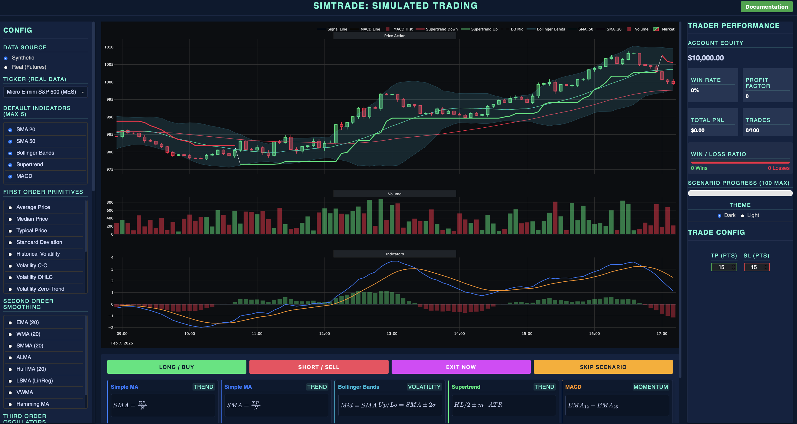

# Future Trading Simulator

A high-frequency trading simulator designed for practicing 5-minute chart scaling and decision making on synthetic Futures data.


python
## Features

- **Synthetic Market Data**: Generates realistic 5-minute OHLCV data using Geometric Brownian Motion (GBM) with volatility clustering.
- **Futures Simulation**: Supports Long/Short positions with leverage, handling PnL calculations and margin.
- **Scenario Mode**: "Game-like" loop where you analyze history, make a decision, and watch the scenario play out in fast-forward.
- **Professional Analytics**: Tracks Win Rate, Profit Factor, and Total Equity across a 100-scenario session.
- **Interactive Controls**:
    - **Trade**: Market Buy/Sell/Skip buttons.
    - **Risk Management**: User-configurable Take Profit (TP %) and Stop Loss (SL %) settings.
    - **Visualization**: Candle chart with EMAs (9, 21) and RSI(14), plus dynamic Entry/TP/SL lines.

## Project Structure

```text
trading_sim/
├── app.py                 # Main Entry Point (Dash App)
├── engine/                # Core Logic
│   ├── gbm_engine.py      # Data Generator
│   ├── simulator.py       # Trading Engine
│   └── analytics.py       # Stats Calculator
├── components/            # UI Modules
│   ├── viewport.py        # Plotly Chart
│   ├── scoreboard.py      # Stats Panel
│   ├── controls.py        # Buttons
│   └── settings.py        # TP/SL Inputs
└── assets/                # Styling
    └── terminal.css       # Dark Theme
```

## Installation

1. Clone or download the repository.
2. Install dependencies:
   ```bash
   pip install -r requirements.txt
   ```
   *(Note: Requires Python 3.8+)*

## Usage

1. Run the application:
   ```bash
   python3 trading_sim/app.py
   ```
2. Open your web browser to [http://127.0.0.1:8050](http://127.0.0.1:8050).
3. **Analyze** the 50-candle history on the chart.
4. **Configure** your TP/SL % in the right panel (e.g., 1%).
5. **Decide**: Click **LONG**, **SHORT**, or **SKIP**.
6. **Watch**: The market simulates the next period rapidly.
7. **Review**: See your PnL updates and move to the next scenario.

## Logic Details

- **Data**: Uses GBM with randomized drift and shock events to ensure every scenario is unique but realistic.
- **Execution**: Trades are entered at the close of the 50th candle.
- **Exit**: 
    - Auto-closes if Price >= TP or Price <= SL.
    - Auto-closes at end of timeframe if neither hit.
- **Leverage**: Defaults to 10x (configurable in code).

## License

MIT License.
