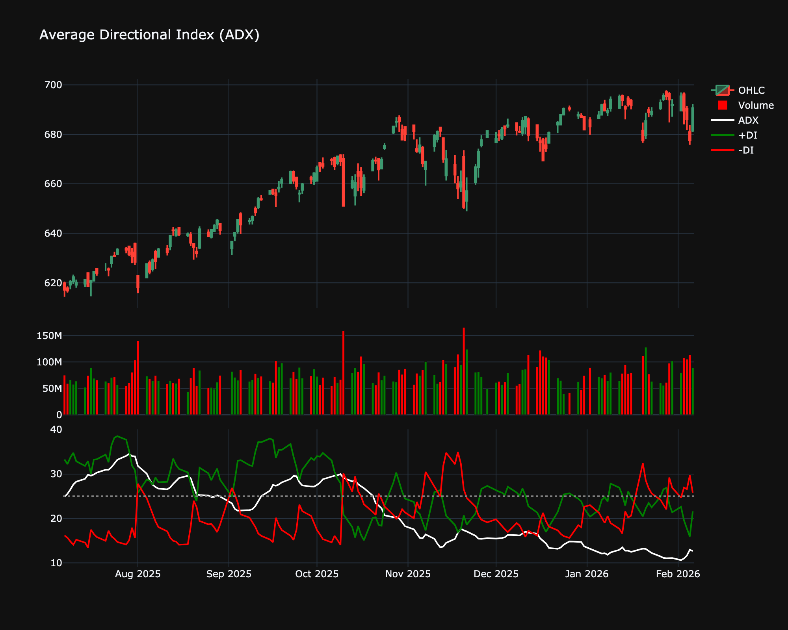

# Average Directional Index (ADX)

| Name | Type | Prerequisite | Use Cases |
| :--- | :--- | :--- | :--- |
| Average Directional Index (ADX) | Trend | EMA | Determining if a market is trending or ranging (values > 25). |

## Definition

The Average Directional Index (ADX) is used to quantify the strength of a trend. ADX stands for Average Directional Movement Index and is used to measure the overall strength of a trend. The ADX indicator is an average of expanding price range values.

## Mathematical Equation

$$
+DI = 100 \times \frac{\text{EMA}(+DM)}{\text{ATR}}
$$

 

$$
-DI = 100 \times \frac{\text{EMA}(-DM)}{\text{ATR}}
$$

 

$$
DX = 100 \times \frac{|(+DI) - (-DI)|}{(+DI) + (-DI)}
$$

 

$$
ADX = \text{EMA}(DX)
$$

## Visualization

## Trading Significance

1. **Trend Strength**: ADX > 25 indicates a strong trend (either up or down). ADX < 20 indicates a weak or non-existent trend.

2. **Direction**: If +DI > -DI, trend is bullish. If -DI > +DI, trend is bearish.

