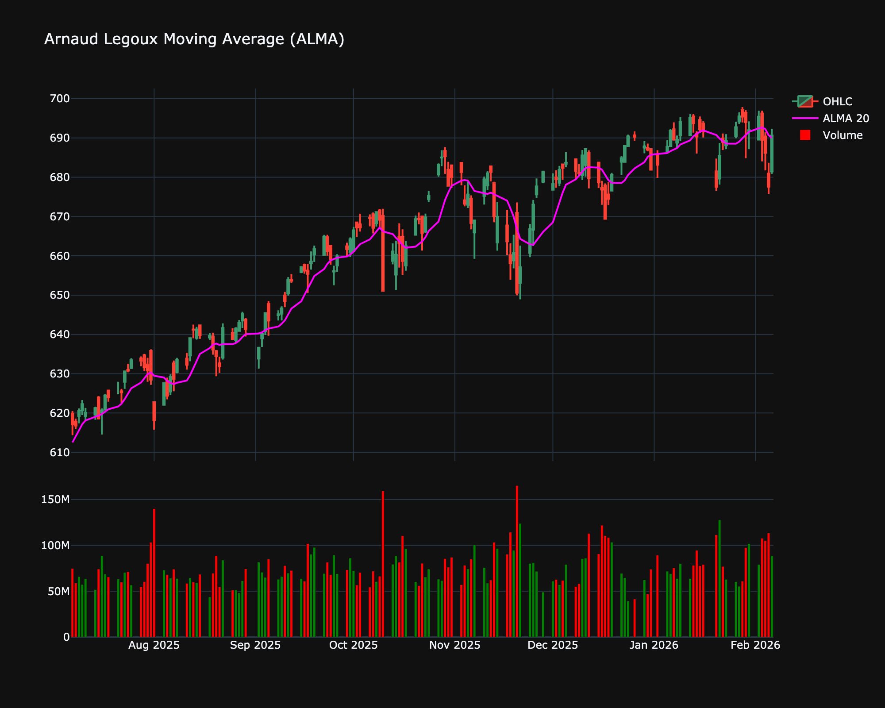

# Arnaud Legoux Moving Average (ALMA)

| Name | Type | Prerequisite | Use Cases |
| :--- | :--- | :--- | :--- |
| Arnaud Legoux MA (ALMA) | Trend | OHLC Data | Superior trend tracking that filters "noise" without sacrificing timing. |

## Definition

The Arnaud Legoux Moving Average (ALMA) is a moving average designed to reduce lag associated with traditional moving averages while preserving responsiveness and smoothness. It uses a Gaussian distribution to weight the prices in the moving window, allowing the user to control the offset (lag) and the width (sigma) of the distribution.

## Mathematical Equation

ALMA applies a weight to the price at time $t-i$ according to a Gaussian function:

$$
w_i = \exp \left( - \frac{(i - \text{offset})^2}{2 \sigma^2} \right)
$$

Where:

*   $i$ ranges from 0 to $N-1$ (window size).

*   $\text{offset} = \text{floor}(\text{offset\_fraction} \times (N - 1))$.

*   $\sigma$ controls the width of the filter.

The ALMA value is the weighted sum of prices:

$$
ALMA_t = \frac{\sum_{i=0}^{N-1} w_i P_{t-i}}{\sum_{i=0}^{N-1} w_i}
$$

## Visualization

## Trading Significance

1.  **Trend Identification**: Like other MAs, ALMA helps identify the trend direction. An uptrend is indicated when price is above ALMA, and downtrend when below.

2.  **Reduced Lag**: ALMA is often preferred over SMA or EMA because it hugs the price action closer without introducing excessive noise, making it effective for signal generation in shorter timeframes.

3.  **Support/Resistance**: It frequently acts as dynamic support or resistance.

