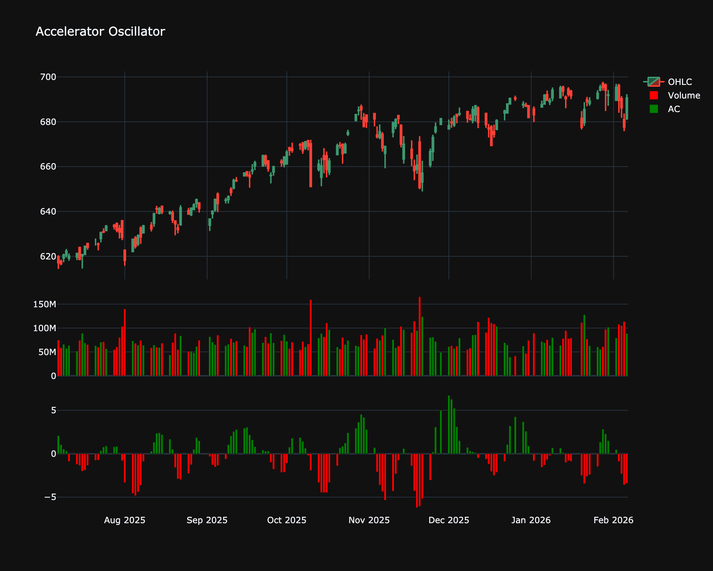

# Accelerator Oscillator (AC)

| Name | Type | Prerequisite | Use Cases |
| :--- | :--- | :--- | :--- |
| Accelerator Oscillator (AC) | Momentum | SMA | Spotting momentum shifts before they appear in price. |

## Definition

Measures the acceleration/deceleration of the Awesome Oscillator.

## Mathematical Equation

$$
AO - SMA_5(AO)
$$

## Special cases

*   **Maximum possible value:** Unbounded
*   **Minimum possible value:** Unbounded
*   **Behavior:** Oscillates around a zero line to measure the acceleration or deceleration of market driving force.

## Visualization

## Trading Significance

*   **Category**: Momentum

*   **Use Case**: Spotting momentum shifts before they appear in price.

