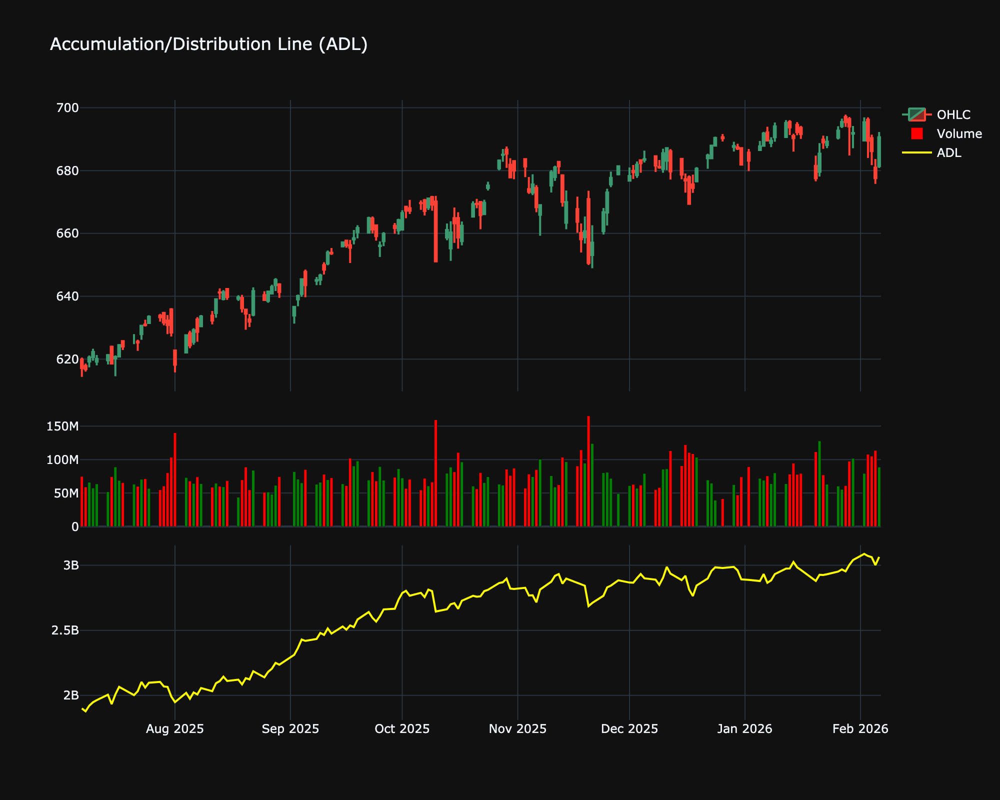

# Accumulation/Distribution Line (ADL)

| Name | Type | Prerequisite | Use Cases |
| :--- | :--- | :--- | :--- |
| Accumulation/Distribution (A/D) | Volume | OHLC Data | Confirming a trend or spotting potential reversals. |

## Definition

The Accumulation/Distribution Line (ADL) is a cumulative indicator that uses volume and price to assess whether a stock is being accumulated or distributed. The ADL seeks to identify divergences between the stock price and volume flow.

## Mathematical Equation

$$
\text{MF Multiplier} = \frac{(Close - Low) - (High - Close)}{High - Low}
$$

$$
\text{MF Volume} = \text{MF Multiplier} \times \text{Volume}
$$

$$
ADL = \text{Previous ADL} + \text{MF Volume}
$$

## Visualization

## Trading Significance

1.  **Trend Confirmation**: If the ADL is rising along with the price, it confirms the uptrend (buying pressure). If ADL is falling with price, it confirms the downtrend (selling pressure).

2.  **Divergence**:

    *   **Bullish Divergence**: Price makes a lower low, but ADL makes a higher low. This suggests selling pressure is waning and a reversal may be imminent.

    *   **Bearish Divergence**: Price makes a higher high, but ADL makes a lower high, suggesting underlying weakness.

