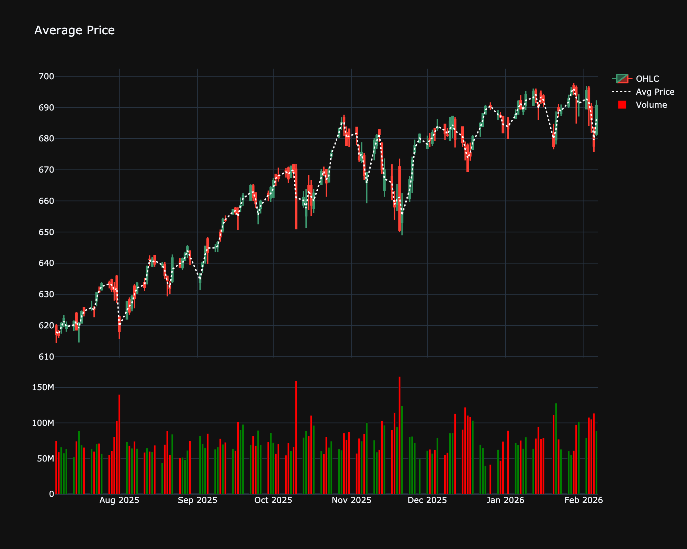

# Average Price

| Name | Type | Prerequisite | Use Cases |
| :--- | :--- | :--- | :--- |
| Average Price (AP) | Trend/Benchmark | OHLC Data | Provides a simplified representation of a single bar's price action. |

## Definition

Average Price is a simple moving average of the Open, High, Low, and Close prices for a single period. It provides a representative price for the bar.

## Mathematical Equation

$$
\text{Average Price} = \frac{\text{Open} + \text{High} + \text{Low} + \text{Close}}{4}
$$

## Visualization

## Trading Significance

1.  **Filtering**: Used to filter out noise from using just the Close price.

2.  **Input**: Often used as an input for other indicators.

