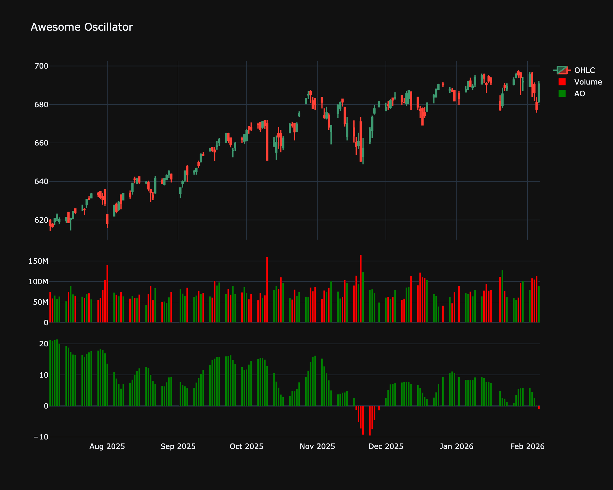

# Awesome Oscillator (AO)

| Name | Type | Prerequisite | Use Cases |
| :--- | :--- | :--- | :--- |
| Awesome Oscillator (AO) | Momentum | SMA | Confirming trends and spotting "Twin Peaks" signals. |

## Definition

The Awesome Oscillator (AO) is a market momentum indicator used to measure market momentum. It calculates the difference between a 34-period Simple Moving Average (SMA) and a 5-period SMA. The SMAs are calculated using the midpoints of the bars ($(\text{High} + \text{Low}) / 2$) rather than closing prices.

## Mathematical Equation

$$
\text{Median Price} = \frac{\text{High} + \text{Low}}{2}
$$

$$
AO = SMA_5(\text{Median Price}) - SMA_{34}(\text{Median Price})
$$

## Visualization

## Trading Significance

1.  **Zero Line Cross**:

    *   **Bullish**: AO crosses from below to above the zero line.

    *   **Bearish**: AO crosses from above to below the zero line.

2.  **Saucer Strategy**: A setup seeking to buy on a "bullish saucer" (two red bars followed by a green bar above zero) or sell on a "bearish saucer" (two green bars followed by a red bar below zero).

3.  **Twin Peaks**:

    *   **Bullish**: Two lows below the zero line, where the second low is higher than the first.

    *   **Bearish**: Two highs above the zero line, where the second high is lower than the first.

