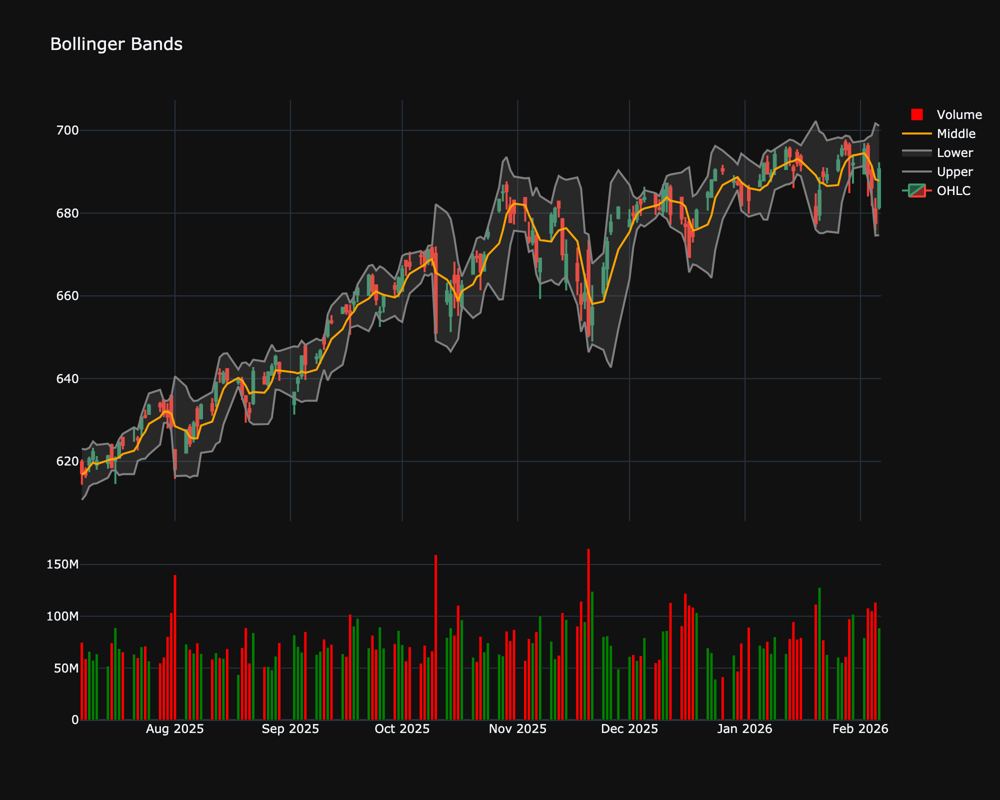

# Bollinger Bands

| Name | Type | Prerequisite | Use Cases |
| :--- | :--- | :--- | :--- |
| Bollinger Bands (BB) | Volatility | StdDev, SMA | Identifying "overextended" prices and volatility squeezes. |

## Definition

Bollinger Bands are a technical analysis tool defined by a set of trendlines plotted two standard deviations (positively and negatively) away from a simple moving average (SMA) of a security's price. They are used to measure market volatility and identify overbought or oversold conditions.

## Mathematical Equation

Bollinger Bands consist of three lines:

**Middle Band**: A simple moving average (usually 20 periods).

$$
\begin{align}
\text{Middle Band} &= \text{SMA}_{20} \\
\text{Upper Band} &= \text{Middle Band} + (2 \times \sigma_{20}) \\
\text{Lower Band} &= \text{Middle Band} - (2 \times \sigma_{20})
\end{align}
$$

Where $\sigma_{20}$ is the standard deviation of the price over the same 20 periods.

## Visualization

## Trading Significance

1.  **Squeeze**: When the bands tighten (come closer together), it indicates low volatility and is often followed by a sharp price move (breakout). This is known as a "Squeeze".

2.  **Breakputs**: A move outside the bands can signal a continuation of the trend, although price often reverts to the mean.

3.  **W-Bottoms**: A double bottom where the second low is lower than the first but holds above the Lower Band is a bullish sign.

4.  **M-Tops**: A double top where the high is higher than the first but fails to touch the Upper Band is a bearish sign.

5.  **Trend Trading**: In a strong uptrend, price tends to hug the Upper Band. In a strong downtrend, price hugs the Lower Band.

