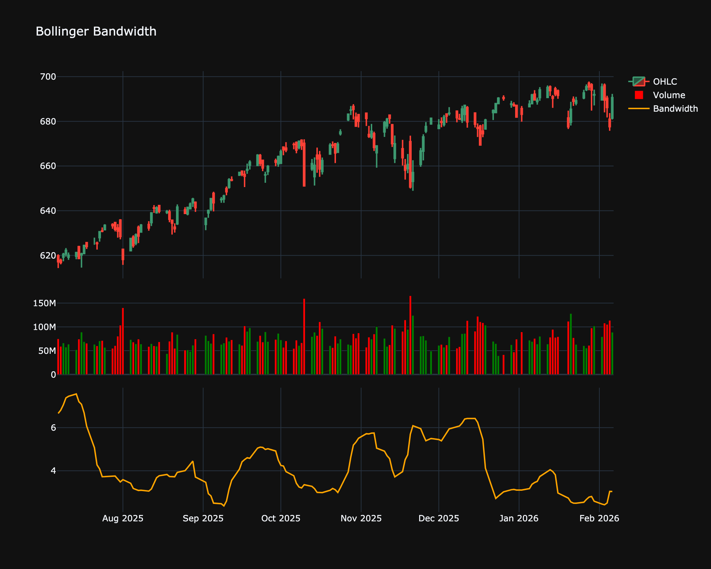

# Bollinger Bandwidth

| Name | Type | Prerequisite | Use Cases |
| :--- | :--- | :--- | :--- |
| Bollinger Bandwidth (BBW) | Volatility | SMA | Detecting the beginning of volatility expansions (the "squeeze"). |

## Definition

Bollinger Bandwidth is an indicator derived from Bollinger Bands. It measures the percentage difference between the Upper Band and the Lower Band. It decreases as volatility decreases (squeeze) and increases as volatility increases.

## Mathematical Equation

$$
\text{Bandwidth} = \frac{\text{Upper Band} - \text{Lower Band}}{\text{Middle Band}} \times 100
$$

## Visualization

## Trading Significance

1.  **The Squeeze**: One of the most common strategies. When Bandwidth hits a multi-month low, it indicates a period of low volatility. Traders expect a consequent expansion in volatility and a potential breakout.

2.  **Trend End**: High Bandwidth values often mark the end of a strong trend as volatility reaches extreme levels.

