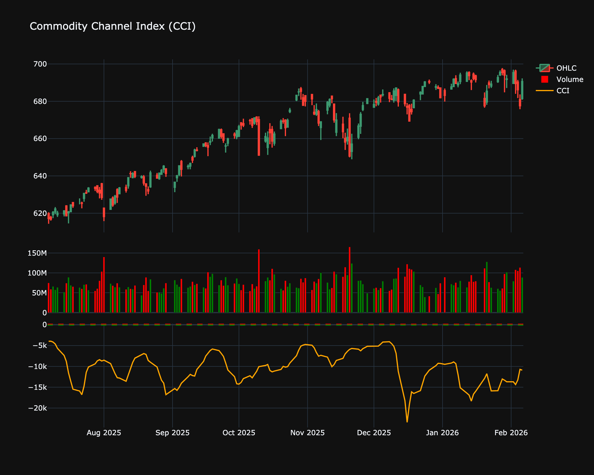

# Commodity Channel Index (CCI)

| Name | Type | Prerequisite | Use Cases |
| :--- | :--- | :--- | :--- |
| Commodity Channel Index (CCI) | Momentum | SMA | Spotting new trends or extreme overbought/oversold conditions. |

## Definition

The Commodity Channel Index (CCI) is a momentum-based oscillator used to help determine when an investment vehicle is reaching a condition of being overbought or oversold. It is also used to assess direction and strength of price returns.

## Mathematical Equation

$$
CCI = \frac{TP - \text{SMA}(TP)}{0.015 \times \text{MD}}
$$

Where:

* $TP = \frac{\text{High} + \text{Low} + \text{Close}}{3}$

* $MD$ = Mean Deviation

## Visualization

## Trading Significance

1. **Overbought/Oversold**: CCI > +100 implies overbought conditions. CCI < -100 implies oversold conditions.

2. **Trend Emerging**: Movement from inside the +/-100 range to outside can signal a new trend.

