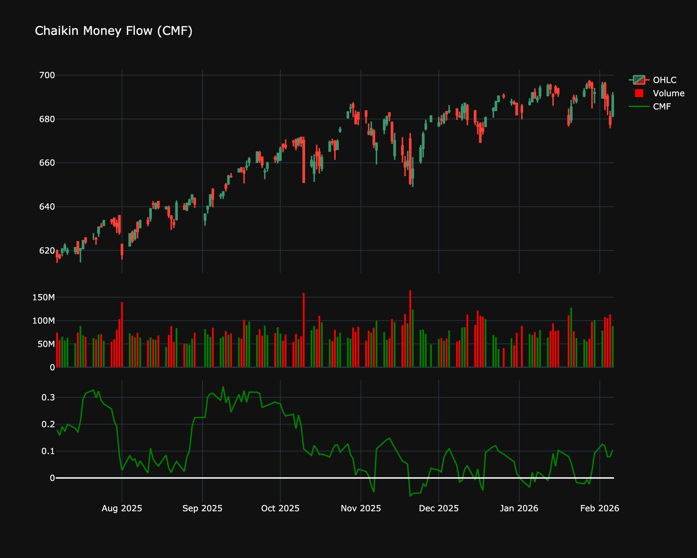

# Chaikin Money Flow (CMF)

| Name | Type | Prerequisite | Use Cases |
| :--- | :--- | :--- | :--- |
| Chaikin Money Flow (CMF) | Volume | Price & Volume | Gauging institutional accumulation or distribution. |

## Definition

Chaikin Money Flow (CMF) measures the amount of Money Flow Volume over a specific period. CMF sums Money Flow Volume over a specific look-back period, typically 20 or 21 days.

## Mathematical Equation

$$
\text{MF Multiplier} = \frac{(\text{Close} - \text{Low}) - (\text{High} - \text{Close})}{\text{High} - \text{Low}}
$$

 

$$
\text{MF Volume} = \text{MF Multiplier} \times \text{Volume}
$$

 

$$
\text{CMF} = \frac{\sum \text{MF Volume}}{\sum \text{Volume}}
$$

## Visualization

## Trading Significance

1. **Buying/Selling Pressure**: CMF > 0 indicates buying pressure. CMF < 0 indicates selling pressure.

2. **Confirmation**: Rising prices with rising CMF confirms uptrend.

