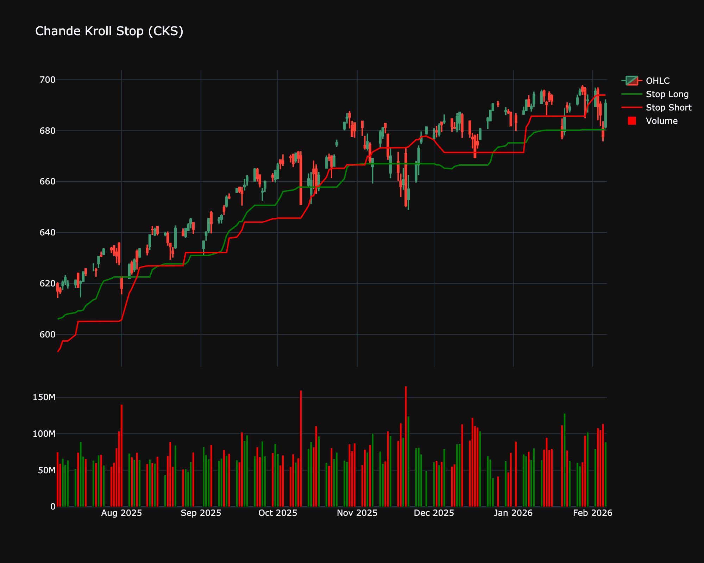

# Chande Kroll Stop (CKS)

| Name | Type | Prerequisite | Use Cases |
| :--- | :--- | :--- | :--- |
| Chande Kroll Stop (CKS) | Volatility/Regime | ATR, High, Low | Dynamic stop losses that don't get hit by random noise. |

## Definition

The Chande Kroll Stop is a volatility-based trend-following indicator developed by Tushar Chande and Stanley Kroll. It is designed to allow a trader to keep a position open as long as the trend is valid, while protecting profits by trailing the stop loss. The indicator calculates two lines: a "Long Stop" (for long positions) and a "Short Stop" (for short positions). These stops are derived from the Average True Range (ATR) and the highest highs/lowest lows of the asset, ensuring the stop is placed outside the typical noise of market volatility.

## Mathematical Equation

The calculation involves three main steps: determining the ATR, calculating the initial stop levels, and then smoothing them to find the final stop lines.

1.  **Calculate ATR**: Compute the Average True Range over period $P$ (usually 10).
2.  **Calculate Preliminary Stops**:
    *   **High Stop**: Highest High of $P$ periods - ($x \times$ ATR of $P$ periods)
    *   **Low Stop**: Lowest Low of $P$ periods + ($x \times$ ATR of $P$ periods)
3.  **Calculate Final Stops**:
    *   **Stop Long**: The Highest "High Stop" over the last $Q$ periods (typically 20).
    *   **Stop Short**: The Lowest "Low Stop" over the last $Q$ periods (typically 20).

$$
\begin{align}
\text{High Stop} &= \max(H, P) - (x \times \text{ATR}_P) \\
\text{Stop Long} &= \max(\text{High Stop}, Q) \\
\text{Stop Short} &= \min(\text{Low Stop}, Q)
\end{align}
$$

Where:
*   $P$ is the ATR length (e.g., 10).
*   $x$ is the multiplier (e.g., 3).
*   $Q$ is the lookback period for the stop (e.g., 20).

## Visualization

## Trading Significance

The Chande Kroll Stop is primarily used for exit management and trend confirmation:

1.  **Trailing Stop Loss**: The primary use is to set stop-loss levels.
    *   **Long Positions**: Place the stop loss at the "Stop Long" line. As prices rise, the line rises, locking in profits. If price closes below this line, exit the trade.
    *   **Short Positions**: Place the stop loss at the "Stop Short" line. As prices fall, the line falls. If price closes above this line, exit the trade.

2.  **Trend Direction**:
    *   **Uptrend**: Price is consistently above the "Stop Long" line.
    *   **Downtrend**: Price is consistently below the "Stop Short" line.
    *   **Trend Reversal**: A crossover of the price relative to the stop lines signals a potential trend change.

3.  **Crosses**:
    *   The Green line (Stop Long) crossing above the Red line (Stop Short) acts as a specialized signal for trend strength, though the primary signal is Price vs. Stop Line.

