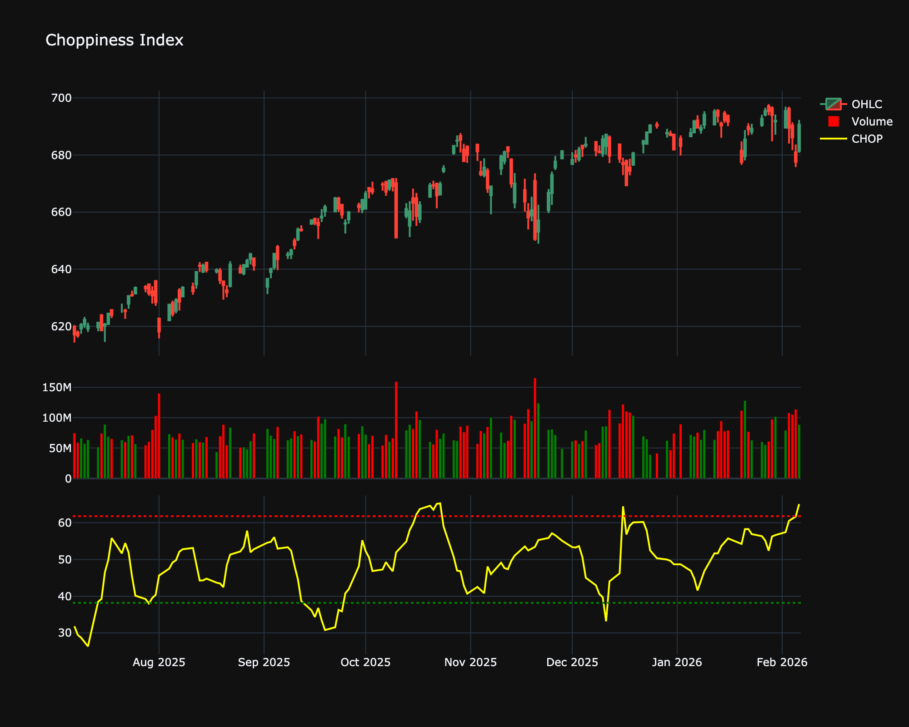

# Choppiness Index

| Name | Type | Prerequisite | Use Cases |
| :--- | :--- | :--- | :--- |
| Choppiness Index (CHOP) | Regime | ATR | Avoiding trading in "sideways" or "choppy" markets (values > 61.8). |

## Definition

The Choppiness Index (CHOP) is designed to determine if the market is choppy (trading sideways) or not choppy (trading within a trend in either direction).

## Mathematical Equation

$$
CHOP = 100 \times \frac{\log_{10}(\frac{\sum \text{ATR}(1)}{\text{MaxHi}(n) - \text{MinLo}(n)})}{\log_{10}(n)}
$$

## Visualization

## Trading Significance

1. **Market State**: Values > 61.8 indicate consolidation (choppy). Values < 38.2 indicate a trend.

2. **Breakout Anticipation**: High values often precede a breakout.

