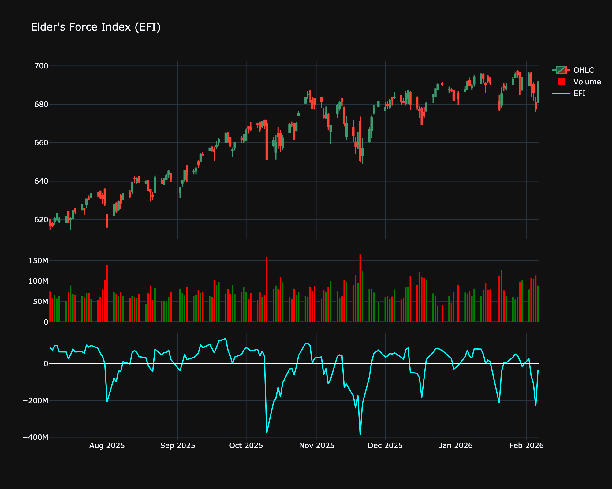

# Elder's Force Index (EFI)

| Name | Type | Prerequisite | Use Cases |
| :--- | :--- | :--- | :--- |
| Elder’s Force Index (EFI) | Volume/Momentum | OHLC Data | Identifying the end of corrections within a trend. |

## Definition

The Force Index is an indicator that uses price and volume to assess the power behind a move or identify possible turning points.

## Mathematical Equation

$$
\text{Force Index} = (\text{Close}_{\text{current}} - \text{Close}_{\text{prev}}) \times \text{Volume}_{\text{current}}
$$

 

The result is typically smoothed with an EMA (e.g., 2-period or 13-period).

## Visualization

## Trading Significance

1. **Trend Confirmation**: Force Index confirms the trend. Positive values confirm uptrends; negative values confirm downtrends.

2. **Divergence**: Divergences between 13-day EMA of Force Index and price often signal reversals.

