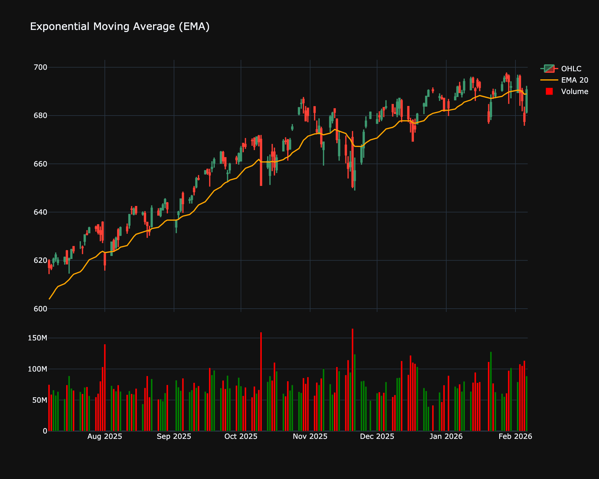

# Exponential Moving Average (EMA)

| Name | Type | Prerequisite | Use Cases |
| :--- | :--- | :--- | :--- |
| Exponential Moving Average (EMA) | Trend | OHLC Data | Reduces lag in trend following compared to SMA. |

## Definition

The Exponential Moving Average (EMA) is a type of moving average that places a greater weight and significance on the most recent data points. The EMA reacts more significantly to recent price changes than a simple moving average (SMA), which applies an equal weight to all observations in the period.

## Mathematical Equation

The formula for calculating the EMA involves using a multiplier to give more weight to the most recent price.

$$
EMA_t = (value_t \times \frac{s}{1+d}) + EMA_{y} \times (1 - \frac{s}{1+d})
$$

Actually, the standard formula is:

$$
EMA_t = [V_t \times (\frac{s}{1+d})] + EMA_{y} \times [1 - (\frac{s}{1+d})]
$$

Where:

*   $EMA_t$ = Current EMA value

*   $V_t$ = Current Value

*   $EMA_y$ = Previous EMA value

*   $s$ = Smoothing factor (typically 2)

*   $d$ = Number of days

Simplified:

$$
k = \frac{2}{N+1}
$$

$$
EMA_{today} = (Price_{today} \times k) + (EMA_{yesterday} \times (1-k))
$$

## Visualization

## Trading Significance

The EMA is preferred by many traders over the SMA because it reduces the lag by weighting recent prices more heavily.

1.  **Trend Confirmation**: Like the SMA, the EMA is used to identify the trend direction. A rising EMA indicates an uptrend, while a falling EMA indicates a downtrend.

2.  **Support and Resistance**: Dynamic support/resistance levels are often identified using EMAs (e.g., the 20-period EMA).

3.  **Crossovers**: The crossing of short-term (e.g., 12-day) and long-term (e.g., 26-day) EMAs provides buy and sell signals.

