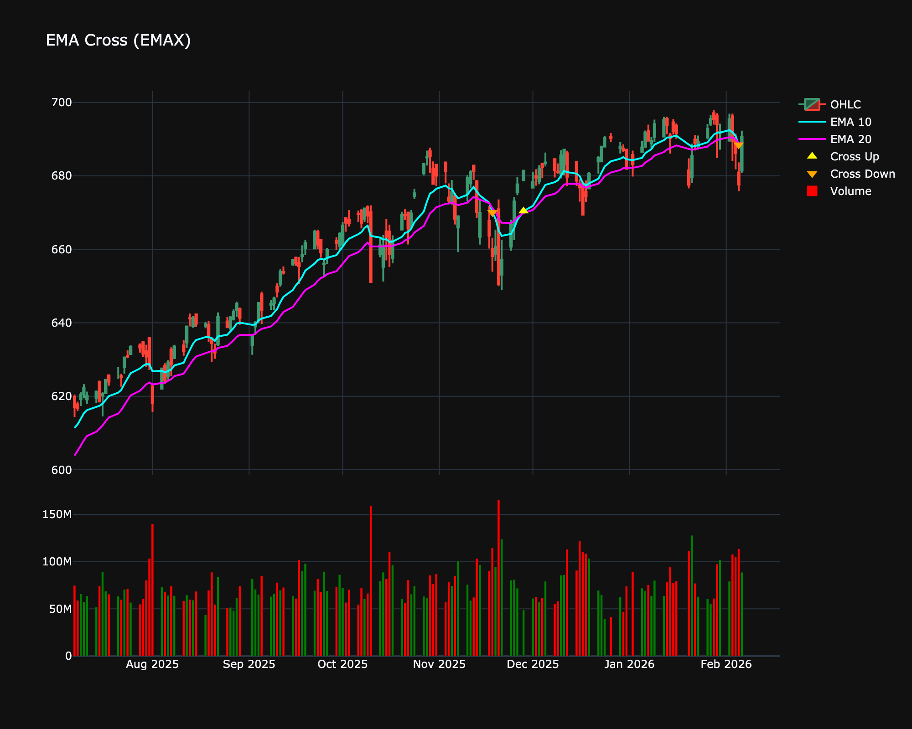

# EMA Cross (EMAX)

| Name | Type | Prerequisite | Use Cases |
| :--- | :--- | :--- | :--- |
| EMA Cross (EMAX) | Trend | OHLC Data | Capturing trend shifts earlier in volatile markets. |

## Definition

Uses exponential averages to signal trend changes with less lag.

## Mathematical Equation

$$
EMA_{fast} - EMA_{slow}
$$

## Visualization

## Trading Significance

*   **Category**: Trend

*   **Use Case**: Capturing trend shifts earlier in volatile markets.

