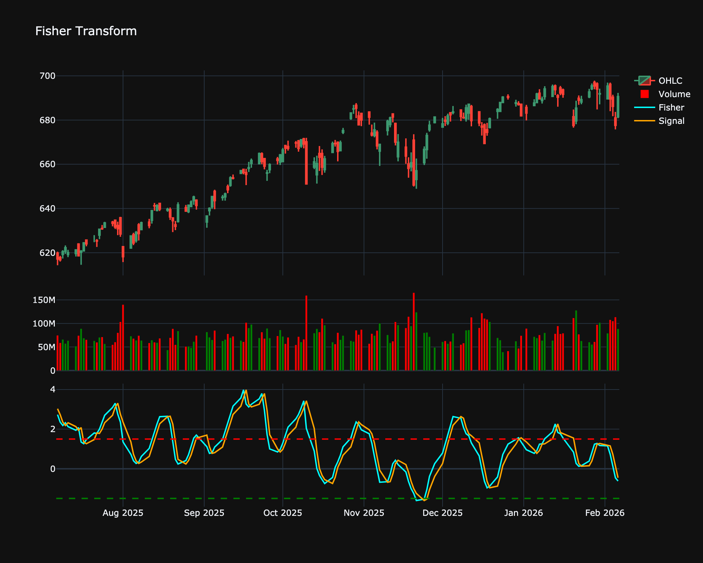

# Fisher Transform

| Name | Type | Prerequisite | Use Cases |
| :--- | :--- | :--- | :--- |
| Fisher Transform (FT) | Momentum | OHLC Data | Pinpointing turning points with extreme clarity. |

## Definition

The Fisher Transform is a technical indicator created by John Ehlers that converts prices into a Gaussian normal distribution. The indicator oscillates above and below a zero line, providing clear turning points and helping to identify trend reversals. Its sharp turning points are often superior to other oscillators for timing entries and exits.

## Mathematical Equation

First, calculate the midpoint price and normalize it to a range of -1 to 1 over $N$ periods. Let this be $x$.

$$
y = 0.5 \times \ln \left( \frac{1+x}{1-x} \right)
$$

The value $y$ is then typically smoothed to produce the final Fisher Transform line. A signal line (often the previous value of the Fisher line) is plotted for crossovers.

## Visualization

## Trading Significance

1.  **Reversals**: The Fisher Transform produces sharp peaks and troughs. An extreme reading followed by a reversal is a strong signal that the price trend may change.

2.  **Crossovers**:

    *   **Buy**: Trigger line crosses above the signal line (or crosses zero from below).

    *   **Sell**: Trigger line crosses below the signal line (or crosses zero from above).

3.  **Extremes**: Values beyond standard deviations (e.g., > 1.5 or < -1.5) indicate potential overbought or oversold conditions.

