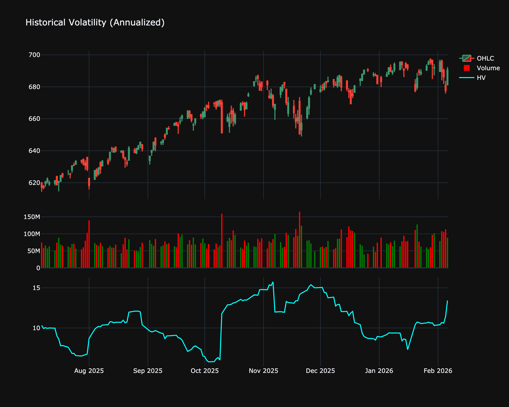

# Historical Volatility

| Name | Type | Prerequisite | Use Cases |
| :--- | :--- | :--- | :--- |
| Historical Volatility (HV) | Volatility | StdDev | Assesses the historical risk profile and prices options. |

## Definition

Historical Volatility (HV) is a statistical measure of the dispersion of returns for a given security or market index over a given period of time. Generally, this measure is calculated by determining the standard deviation of the logarithmic returns.

## Mathematical Equation

1.  Calculate Log Returns: $r_t = \ln(P_t / P_{t-1})$.

2.  Calculate Standard Deviation of $r$ over $N$ periods: $\sigma$.

3.  Annualize: $HV = \sigma \times \sqrt{252} \times 100$.

## Visualization

## Trading Significance

1.  **Risk Assessment**: Higher volatility implies higher risk.

2.  **Option Pricing**: It is a key input in option pricing models like Black-Scholes.

3.  **Breakout**: Low historical volatility often precedes a breakout.

