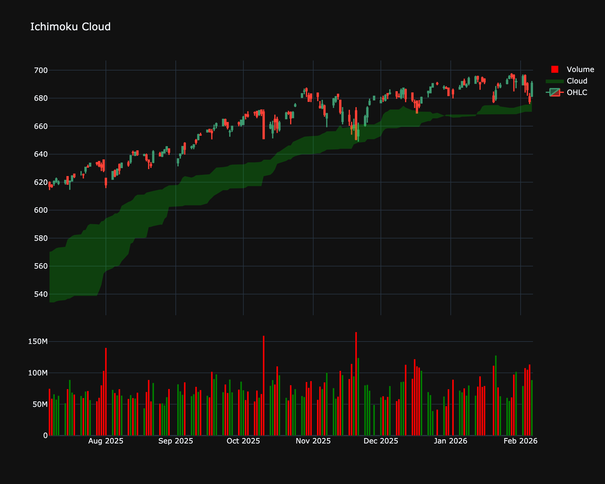

# Ichimoku Cloud (Ichimoku Kinko Hyo)

| Name | Type | Prerequisite | Use Cases |
| :--- | :--- | :--- | :--- |
| Ichimoku Cloud (ICH) | Trend/Regime | OHLC Data | Full market-regime analysis. |

## Definition

The Ichimoku Cloud is a collection of technical indicators that show support and resistance levels, as well as momentum and trend direction. It does this by taking multiple averages and plotting them on the chart. It also uses these figures to compute a 'cloud' which attempts to forecast where the price may find support or resistance in the future.

## Mathematical Equation

$$
\text{Tenkan-sen} = \frac{(\text{9-period High} + \text{9-period Low})}{2}
$$

 

$$
\text{Kijun-sen} = \frac{(\text{26-period High} + \text{26-period Low})}{2}
$$

 

$$
\text{Senkou Span A} = \frac{(\text{Tenkan-sen} + \text{Kijun-sen})}{2}
$$

 

$$
\text{Senkou Span B} = \frac{(\text{52-period High} + \text{52-period Low})}{2}
$$

 

$$
\text{Chikou Span} = \text{Close plotted 26 periods back}
$$

## Visualization

## Trading Significance

1. **Trend Identification**: Price above cloud = uptrend, below = downtrend.

2. **Kumo Breakout**: Breaking through the cloud is a strong continuation signal.

3. **TK Cross**: Tenkan crossing Kijun is a signal similar to MA crossover (Tenkan = Fast, Kijun = Slow).

