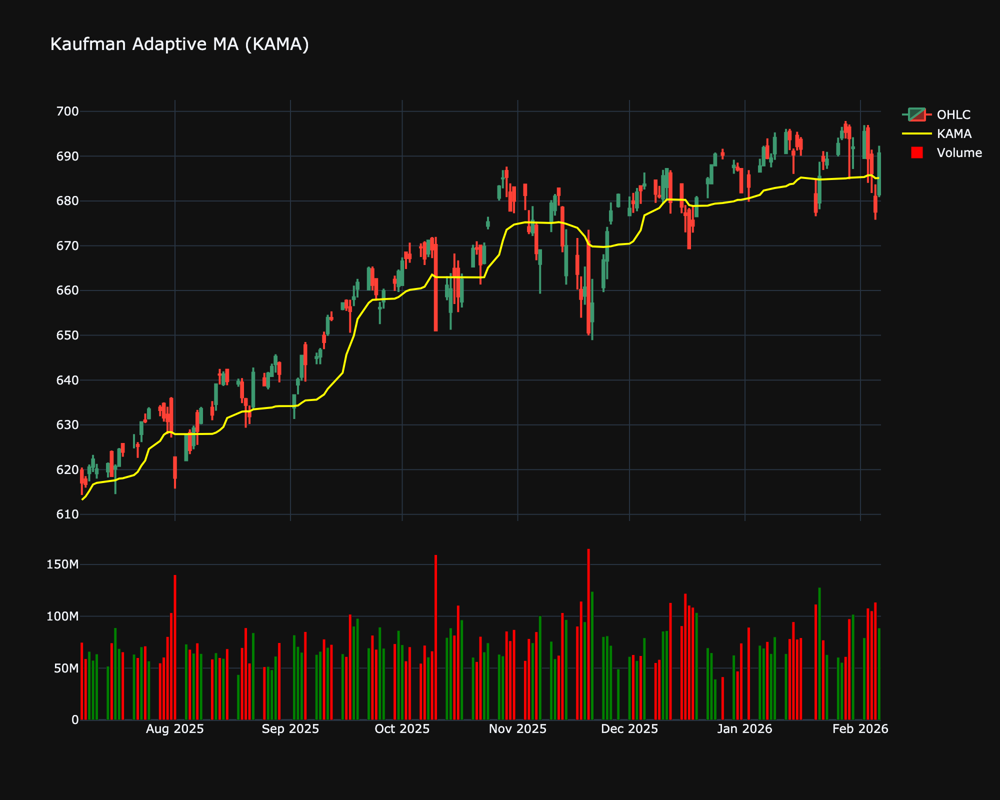

# Kaufman's Adaptive Moving Average (KAMA)

| Name | Type | Prerequisite | Use Cases |
| :--- | :--- | :--- | :--- |
| Kaufman Adaptive MA (KAMA) | Trend/Adaptive | OHLC Data | Following trends in noisy markets without getting whipsawed. |

## Definition

Developed by Perry Kaufman, KAMA is an intelligent moving average that accounts for market noise or volatility. It moves closely to the price when noise is low (trends) and smooths out the noise when volatility is high.

## Mathematical Equation

$$
ER = \frac{|\text{Change}|}{\text{Volatility}}
$$

 

$$
SC = [ER \times (\text{fast} - \text{slow}) + \text{slow}]^2
$$

 

$$
KAMA_t = KAMA_{t-1} + SC \times (Price - KAMA_{t-1})
$$

## Visualization

## Trading Significance

1. **Adaptive**: Automatically adjusts to market conditions.

2. **Trend Filter**: Horizontal KAMA indicates ranging market; sloping KAMA indicates trend.

