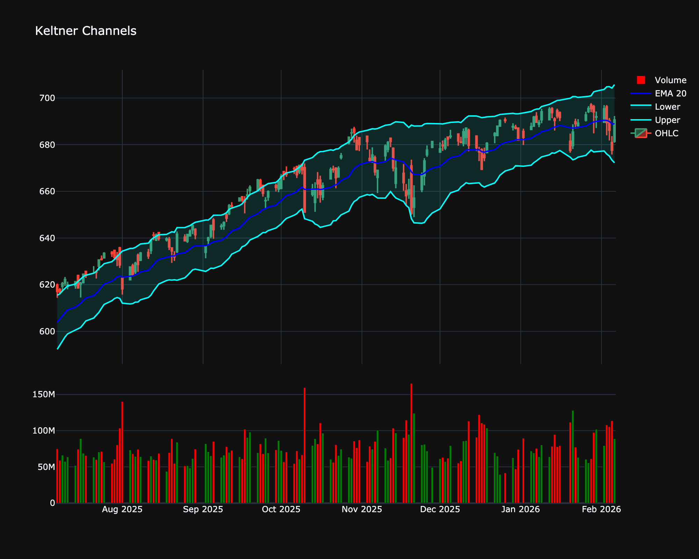

# Keltner Channels

| Name | Type | Prerequisite | Use Cases |
| :--- | :--- | :--- | :--- |
| Keltner Channels (KC) | Volatility | ATR, EMA | Filtering price noise in trending markets more effectively than BB. |

## Definition

Keltner Channels are volatility-based bands that are placed on either side of an asset's price and can aid in determining the direction of a trend.

## Mathematical Equation

$$
\text{Middle Line} = \text{EMA}_{20}
$$

 

$$
\text{Upper Band} = \text{EMA}_{20} + (2 \times \text{ATR}_{10})
$$

 

$$
\text{Lower Band} = \text{EMA}_{20} - (2 \times \text{ATR}_{10})
$$

## Visualization

## Trading Significance

1. **Trend Identification**: Breakout above upper channel signals uptrend.

2. **Reversion**: Price often reverts to the middle EMA in trends.

