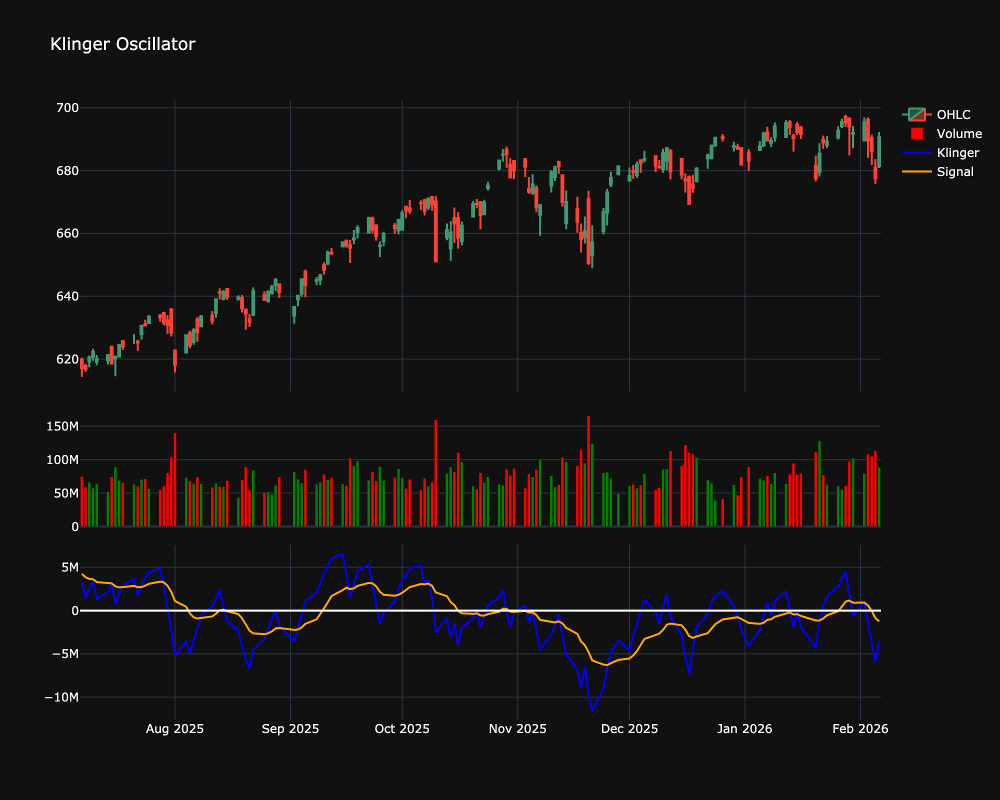

# Klinger Oscillator

| Name | Type | Prerequisite | Use Cases |
| :--- | :--- | :--- | :--- |
| Klinger Oscillator (KO) | Volume | EMA | Long-term trend confirmation and short-term timing. |

## Definition

The Klinger Oscillator (KO) was developed by Stephen Klinger to determine the long-term trend of money flow while remaining sensitive enough to detect short-term fluctuations. It compares the volume flowing in and out of a security to price movement, and it is then turned into an oscillator.

## Mathematical Equation

The calculation is complex but involves:

1.  Defining the Trend Direction using High, Low, and Close.

2.  Calculating Volume Force ($VF$) using volume, trend, and a temp value based on price range.

3.  Calculating two EMAs of $VF$ (typically 34-period and 55-period).

    

$$
KO = EMA_{34}(VF) - EMA_{55}(VF)
$$

4.  A Signal Line (usually 13-period EMA of KO) is plotted.

## Visualization

## Trading Significance

1.  **Signal Line Crossover**:

    *   **Buy**: KO crosses above the Signal Line.

    *   **Sell**: KO crosses below the Signal Line.

2.  **Divergence**: Divergence between price and volume is a key signal. For example, if price is rising but the KO is falling, it suggests the uptrend is losing volume support.

3.  **Zero Line**: Crossovers of the zero line indicate a shift in the long-term money flow trend.

