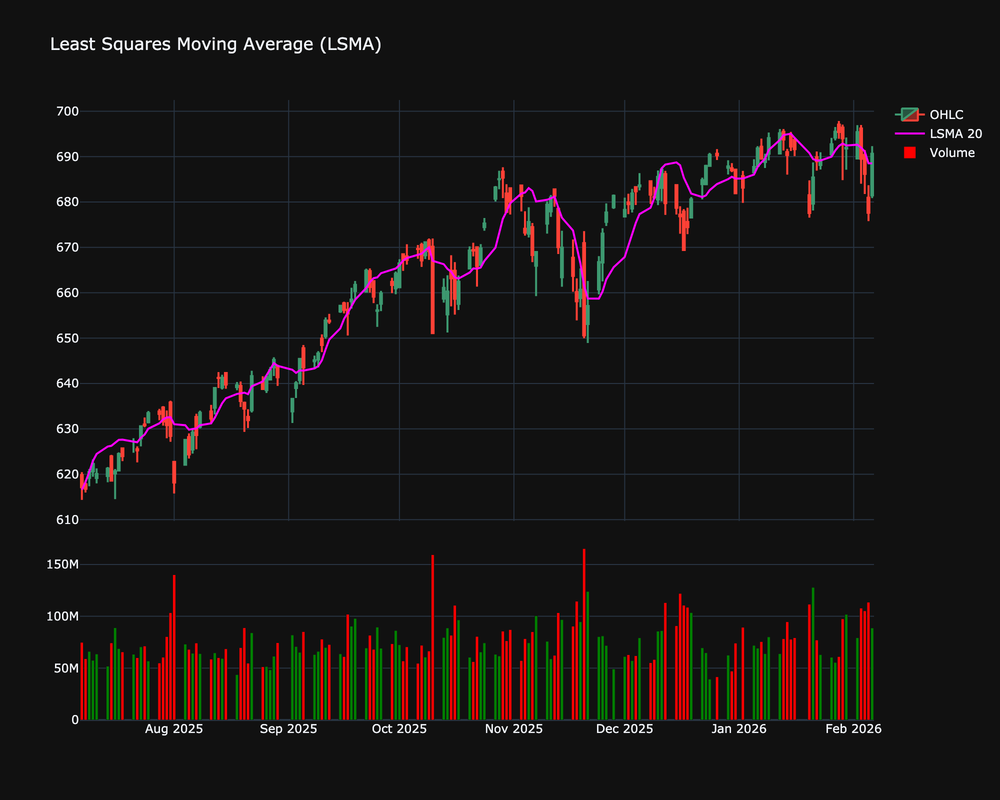

# Least Squares Moving Average (LSMA)

| Name | Type | Prerequisite | Use Cases |
| :--- | :--- | :--- | :--- |
| Least Squares MA (LSMA) | Trend | OHLC Data | Anticipating where price should be if the current trend continues linearly. |

## Definition

The Least Squares Moving Average (LSMA), also known as the End Point Moving Average or Linear Regression Curve, calculates the endpoint of the linear regression line for each period. It attempts to predict what the price would be if the regression line continued. It is often used as a signal line or a filter for other indicators.

## Mathematical Equation

For each point $t$, fit a linear regression line ($y = mx + b$) to the prices over the last $N$ periods. The LSMA value at $t$ is the value of this line at time $t$ (the endpoint).

## Visualization

## Trading Significance

1.  **Trend direction**: If LSMA is pointing up, the trend is bullish. If pointing down, bearish.

2.  **Crossovers**: Price crossing the LSMA is often used as a trend entry signal.

3.  **Fit**: It hugs the price much closer than an SMA, reducing lag, but can be "whippy" in sideways markets.

