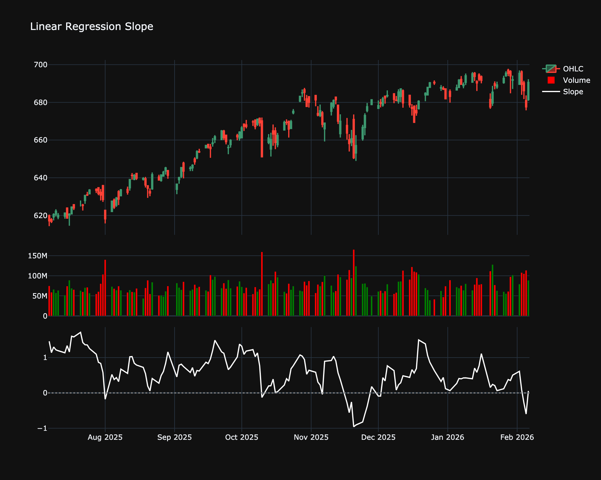

# Linear Regression Slope

| Name | Type | Prerequisite | Use Cases |
| :--- | :--- | :--- | :--- |
| Linear Regression Slope (LRS) | Momentum | OHLC Data | Identifying trend strength and potential exhaustion. |

## Definition

The Linear Regression Slope indicator displays the slope (steepness and direction) of the linear regression line fitted to the price over a specified period. It measures the strength and direction of the trend.

## Mathematical Equation

For a rolling window of $N$ periods, calculate the slope $m$ of the best-fit line $y = mx + b$ using the least squares method:

$$
m = \frac{n \sum (xy) - \sum x \sum y}{n \sum x^2 - (\sum x)^2}
$$

*   **Positive Slope**: Uptrend.

*   **Negative Slope**: Downtrend.

*   **High Absolute Value**: Strong trend.

## Visualization

## Trading Significance

1.  **Trend Strength**: The steeper the slope, the stronger the trend.

2.  **Trend Reversal**: A change in the sign of the slope (crossing zero) indicates a potential change in trend direction.

