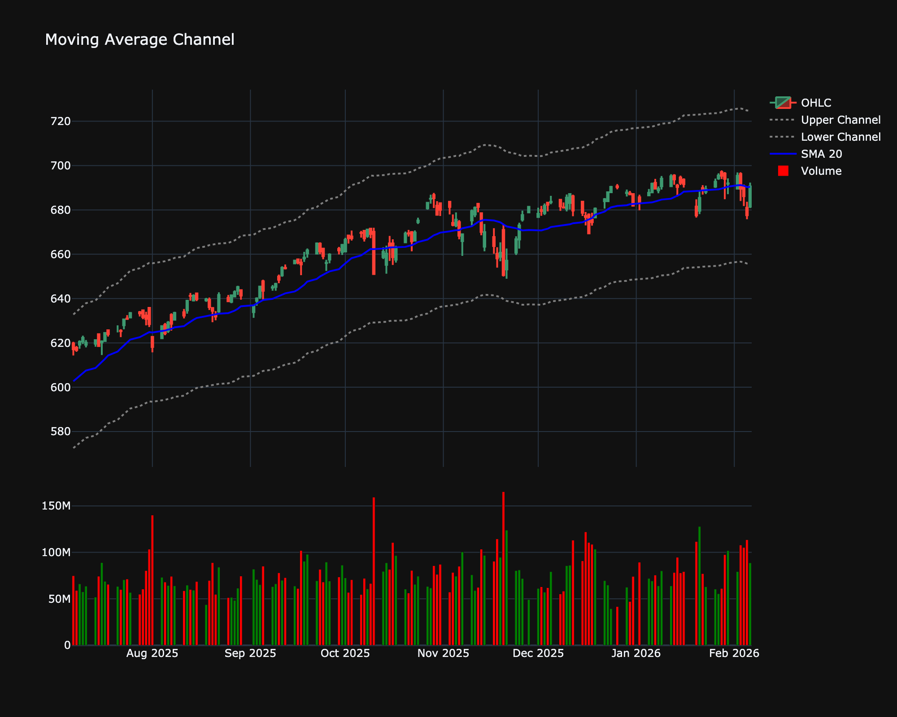

# Moving Average Channel (MAC)

| Name | Type | Prerequisite | Use Cases |
| :--- | :--- | :--- | :--- |
| Moving Average Channel (MAC) | Trend | SMA | Identifying the "trading range" of a specific trend. |

## Definition

Uses the High and Low prices for the averages to create a price "envelope."

## Mathematical Equation

$$
Upper = SMA(H, n), Lower = SMA(L, n)
$$

## Special cases

*   **Maximum possible value:** Unbounded
*   **Minimum possible value:** 0
*   **Behavior:** Follows the price, creating bounds around a central moving average.

## Visualization

## Trading Significance

*   **Category**: Trend

*   **Use Case**: Identifying the "trading range" of a specific trend.

