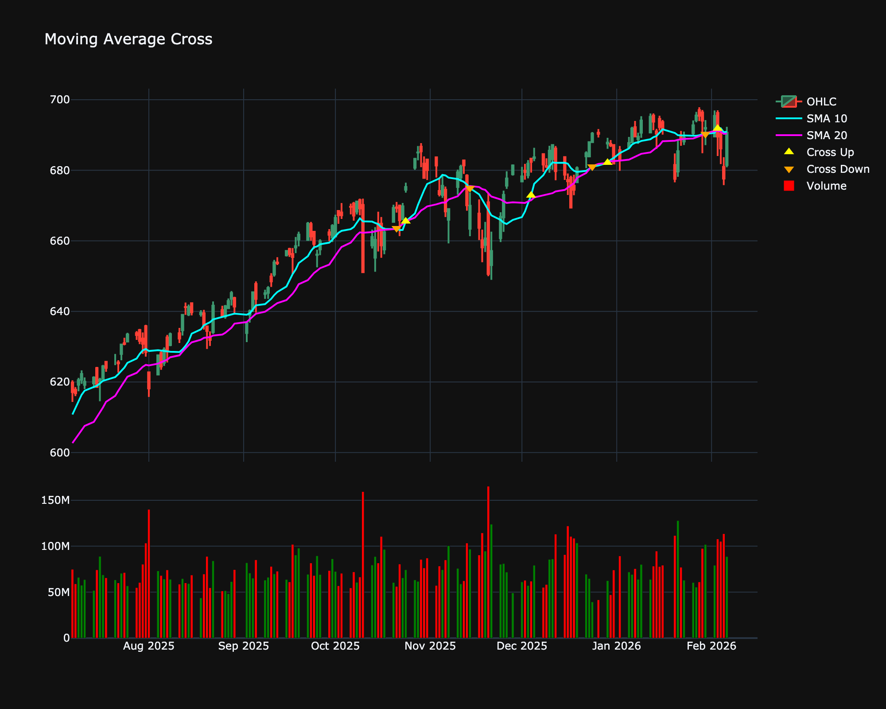

# Moving Average Cross (MAX)

| Name | Type | Prerequisite | Use Cases |
| :--- | :--- | :--- | :--- |
| Moving Average Cross (MAX) | Trend | SMA | Defining broad bullish or bearish regimes (e.g., Golden Cross). |

## Definition

A signal generated when a fast SMA crosses above or below a slow SMA.

## Mathematical Equation

$$
SMA_{fast} - SMA_{slow}
$$

## Special cases

*   **Maximum possible value:** Unbounded
*   **Minimum possible value:** 0
*   **Behavior:** Follows the price. The crossover of fast and slow MAs marks trend shifts.

## Visualization

## Trading Significance

*   **Category**: Trend

*   **Use Case**: Defining broad bullish or bearish regimes (e.g., Golden Cross).

