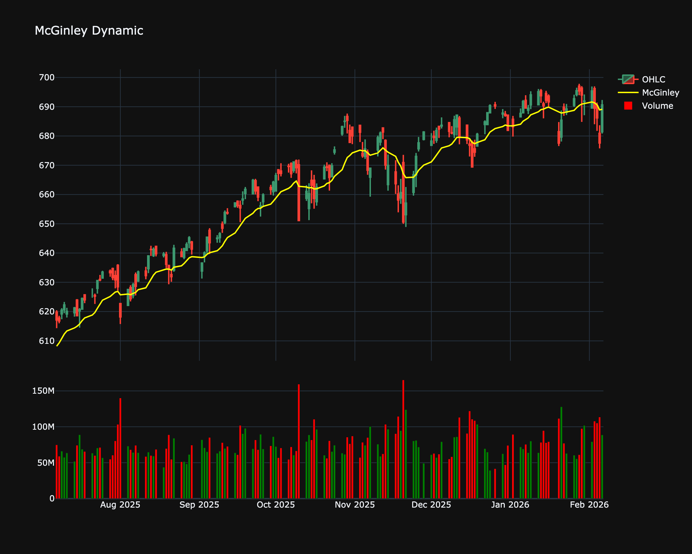

# McGinley Dynamic (MD)

| Name | Type | Prerequisite | Use Cases |
| :--- | :--- | :--- | :--- |
| McGinley Dynamic (MD) | Trend/Adaptive | OHLC Data | Avoiding the "separation" of price and average in fast moves. |

## Definition

An adaptive average designed to follow price more accurately than traditional MAs.

## Mathematical Equation

$$
MD_{prev} + \frac{C - MD_{prev}}{k \cdot n \cdot (C/MD_{prev})^4}
$$

## Special cases

*   **Maximum possible value:** Unbounded
*   **Minimum possible value:** 0
*   **Behavior:** Follows the price, automatically adjusting its speed to minimize separation from price.

## Visualization

## Trading Significance

*   **Category**: Trend/Adaptive

*   **Use Case**: Avoiding the "separation" of price and average in fast moves.

