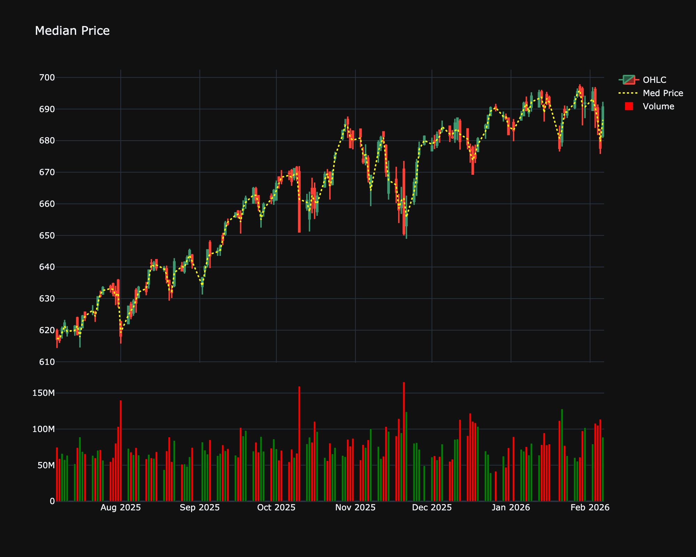

# Median Price

| Name | Type | Prerequisite | Use Cases |
| :--- | :--- | :--- | :--- |
| Median Price (MP) | Trend/Benchmark | OHLC Data | Identifies the midpoint of a bar's range, often used as an input for oscillators. |

## Definition

Median Price is the average of the High and Low prices for a single period. It represents the midpoint of the trading range for that bar.

## Mathematical Equation

$$
\text{Median Price} = \frac{\text{High} + \text{Low}}{2}
$$

## Visualization

## Trading Significance

1.  **Midpoint**: Identifies the center of the trading activity for the period.

2.  **Simplification**: A simpler view of price action than OHLC bars.

