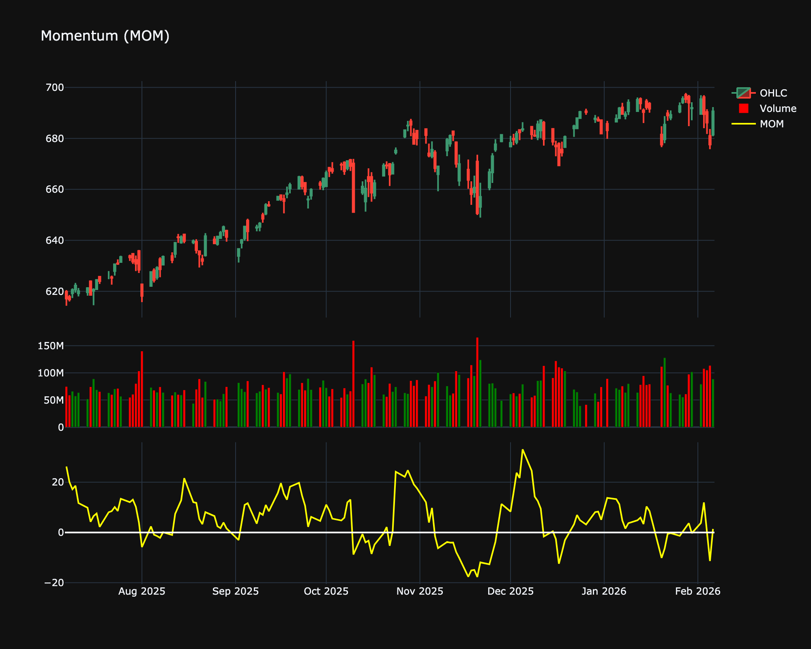

# Momentum (MOM)

| Name | Type | Prerequisite | Use Cases |
| :--- | :--- | :--- | :--- |
| Momentum (MOM) | Momentum | OHLC Data | Simplest measure of trend strength and direction. |

## Definition

The absolute difference in price over a fixed lookback period.

## Mathematical Equation

$$
C_t - C_{t-n}
$$

## Special cases

*   **Maximum possible value:** Unbounded
*   **Minimum possible value:** Unbounded
*   **Behavior:** Oscillates around a zero line (or 100 line), measuring the rate of change in price.

## Visualization

## Trading Significance

*   **Category**: Momentum

*   **Use Case**: Simplest measure of trend strength and direction.

