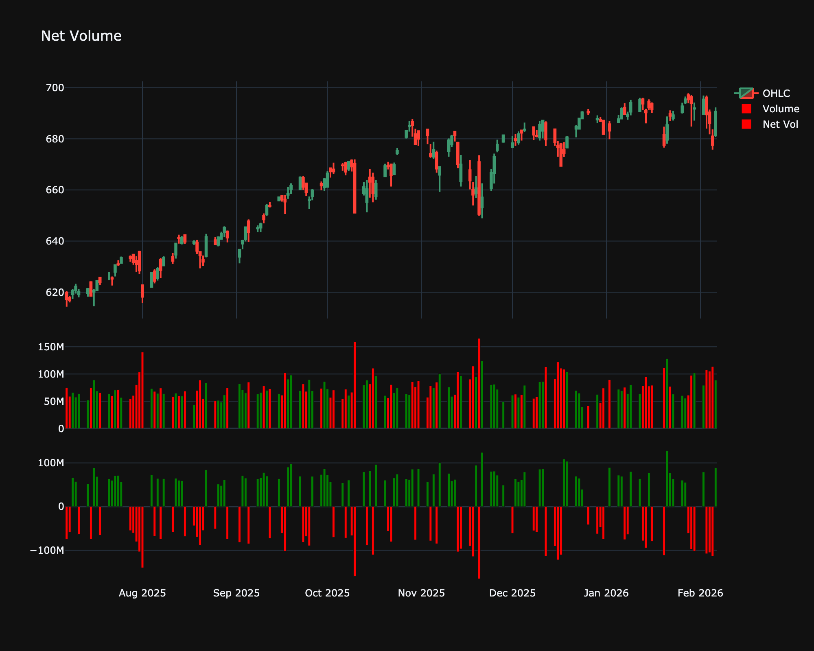

# Net Volume

| Name | Type | Prerequisite | Use Cases |
| :--- | :--- | :--- | :--- |
| Net Volume (NV) | Volume | Price & Volume | Visualizes net capital flow into or out of an asset. |

## Definition

Net Volume is a simple indicator that calculates the net buying or selling pressure for a given period. It is typically calculated by multiplying the volume by the sign of the price change. If the price closes higher, the volume is considered positive; if lower, negative.

## Mathematical Equation

$$
\text{Net Volume}_t = Volume_t \times \text{sign}(Close_t - Close_{t-1})
$$

Where:

*   $\text{sign}(x) = 1$ if $x > 0$

*   $\text{sign}(x) = -1$ if $x < 0$

*   $\text{sign}(x) = 0$ if $x = 0$

## Visualization

## Trading Significance

1.  **Buying/Selling Pressure**: Positive bars indicate net buying pressure, while negative bars indicate net selling pressure.

2.  **Volume Spikes**: Large spikes in net volume can confirm the strength of a price move or signal a potential reversal (climax).

3.  **Cumulative**: Sometimes plotted cumulatively (like OBV) to show the aggregate flow over time.

