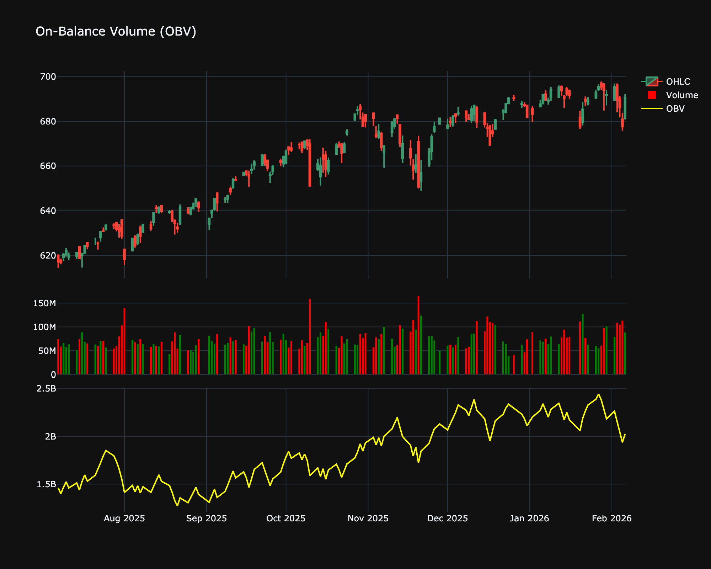

# On-Balance Volume (OBV)

| Name | Type | Prerequisite | Use Cases |
| :--- | :--- | :--- | :--- |
| On-Balance Volume (OBV) | Volume | Price & Volume | Identifying divergence between price and volume. |

## Definition

On-Balance Volume (OBV) is a technical trading momentum indicator that uses volume flow to predict changes in stock price. It accumulates buying and selling volume.

## Mathematical Equation

$$
OBV_t = OBV_{t-1} + \begin{cases} \text{Volume}_t & \text{if } P_t > P_{t-1} \\ 0 & \text{if } P_t = P_{t-1} \\ -\text{Volume}_t & \text{if } P_t < P_{t-1} \end{cases}
$$

## Visualization

## Trading Significance

1. **Volume Precedes Price**: Use OBV to confirm trends. If price is rising but OBV is flat or falling, the trend may be weak.

2. **Divergence**: Bullish/Bearish divergence between price and OBV often signals reversals.

