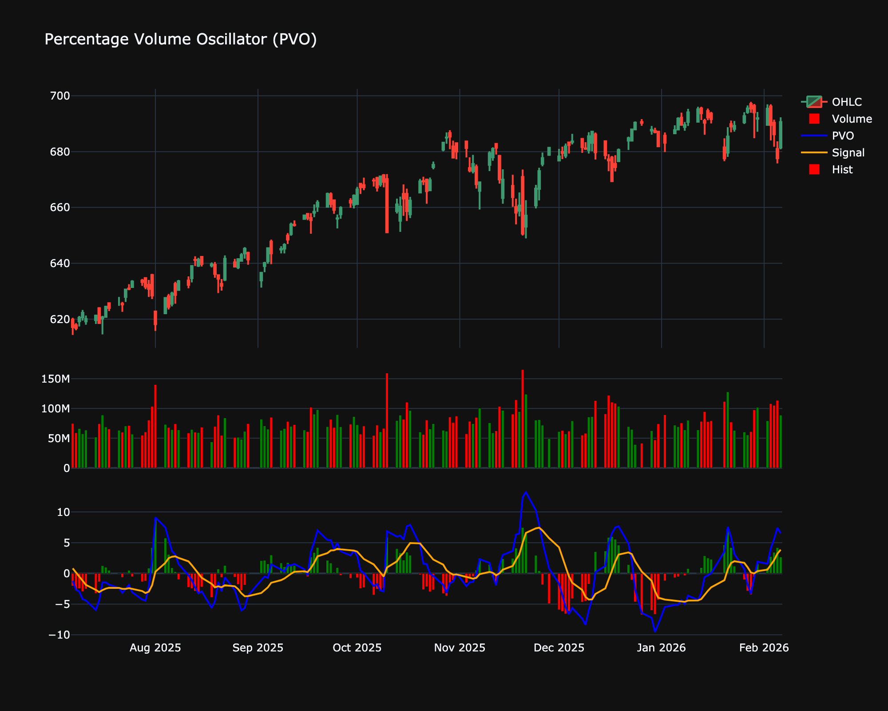

# Percentage Volume Oscillator (PVO)

| Name | Type | Prerequisite | Use Cases |
| :--- | :--- | :--- | :--- |
| Volume Oscillator (VO) | Volume | EMA | Identifying when volume is expanding or contracting. |

## Definition

The Percentage Volume Oscillator (PVO) is a momentum oscillator for volume. It measures the percentage difference between two moving averages of volume. It is similar to MACD, but for volume instead of price.

## Mathematical Equation

$$
PVO = \frac{EMA_{12}(Volume) - EMA_{26}(Volume)}{EMA_{26}(Volume)} \times 100
$$

A signal line (9-period EMA of PVO) is often plotted to generate signals.

## Visualization

## Trading Significance

1.  **Trend Confirmation**: Rising PVO indicates volume is increasing, which can confirm a price trend. Falling PVO indicates decreasing volume.

2.  **Breakout Validation**: A higher PVO on a breakout confirms the strength of the move.

3.  **Divergence**: Divergence between PVO and price can signal a potential reversal.

