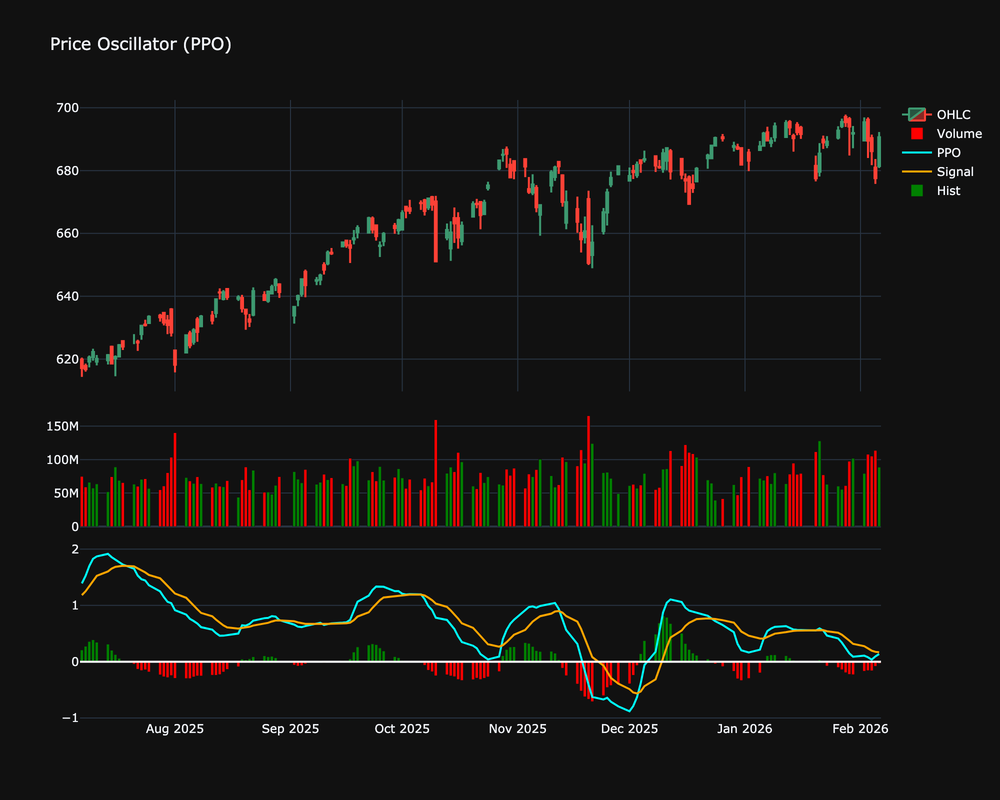

# Price Oscillator (PO)

| Name | Type | Prerequisite | Use Cases |
| :--- | :--- | :--- | :--- |
| Price Oscillator (PO) | Momentum | OHLC Data | Comparing momentum across different assets regardless of price level. |

## Definition

The percentage difference between two moving averages.

## Mathematical Equation

$$
(\frac{MA_{fast} - MA_{slow}}{MA_{slow}}) \times 100
$$

## Visualization

## Trading Significance

*   **Category**: Momentum

*   **Use Case**: Comparing momentum across different assets regardless of price level.

