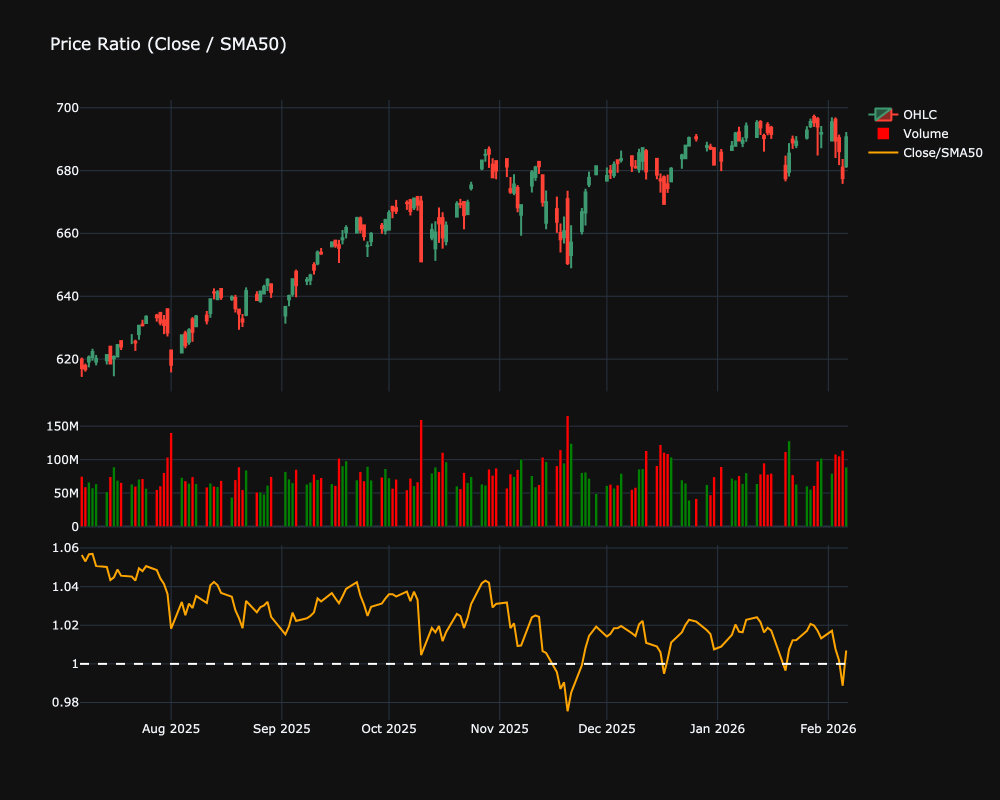

# Ratio

| Name | Type | Prerequisite | Use Cases |
| :--- | :--- | :--- | :--- |
| Ratio (RAT) | Relative Value | OHLC Data | Inter-market analysis (e.g., Gold/Silver ratio) to find relative outperformance. |

## Definition

The Ratio indicator simply divides one data series by another (e.g., Item A / Item B). It is used to compare the relative strength or valuation of two assets.

## Mathematical Equation

$$
\text{Ratio} = \frac{\text{Series A}}{\text{Series B}}
$$

## Special cases

*   **Maximum possible value:** Unbounded
*   **Minimum possible value:** 0
*   **Behavior:** Moves independently showing the relative performance or spread between two assets/series.

## Visualization

## Trading Significance

1.  **Relative Strength**: Used to see if one asset is outperforming another (e.g., Tech vs. SP500).

