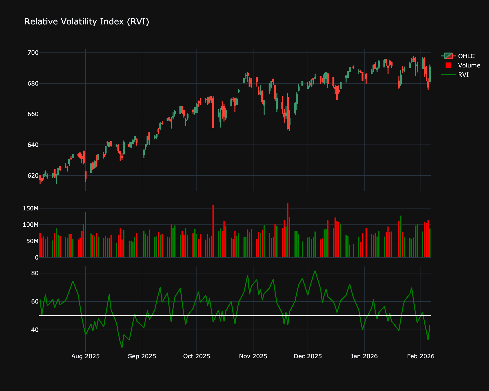

# Relative Volatility Index (RVI)

| Name | Type | Prerequisite | Use Cases |
| :--- | :--- | :--- | :--- |
| Relative Volatility Index (RVI-V) | Volatility/Momentum | RSI, StdDev | Confirming breakout signals. |

## Definition

The Relative Volatility Index (RVI) was developed by Donald Dorsey. It is similar to the Relative Strength Index (RSI), but instead of measuring price changes, it measures the standard deviation of price changes. It is designed to measure the direction of volatility.

## Mathematical Equation

The RVI typically calculates a 10-day standard deviation of the High and Low prices.

1.  If Close > Open, it's an "Up" volatility.

2.  If Close < Open, it's a "Down" volatility.

3.  Apply the RSI formula to these "Up" and "Down" volatility series.

## Visualization

## Trading Significance

1.  **Confirmation**: RVI is often used as a confirmation indicator for other signals. For example, if a Moving Average Crossover generates a buy signal, a trader might check if RVI is > 50.

2.  **Trend Direction**: RVI > 50 indicates that volatility is to the upside (bullish), while RVI < 50 indicates volatility is to the downside (bearish).

