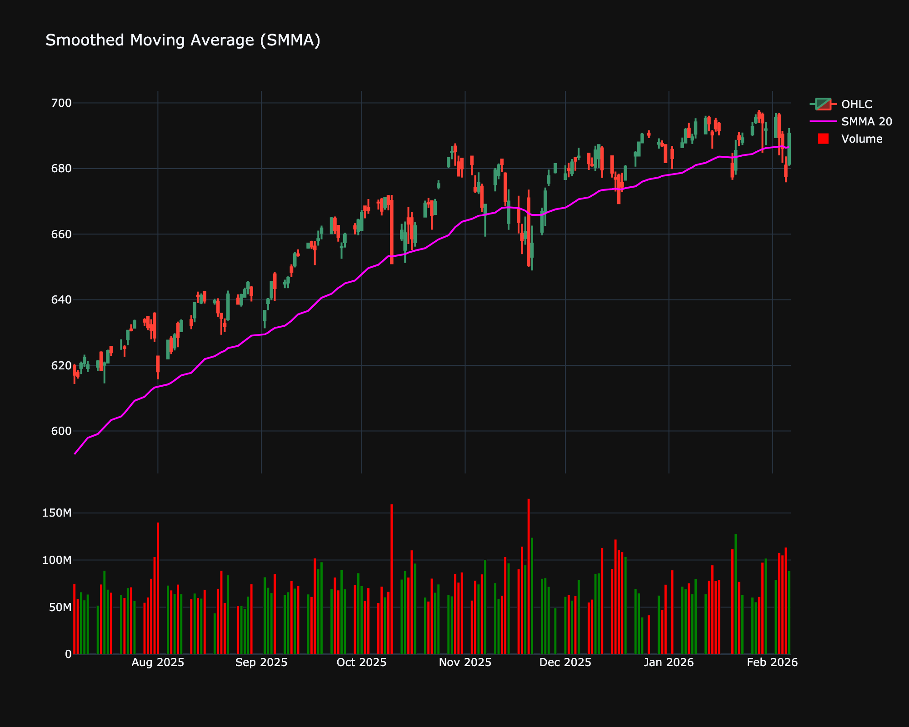

# Smoothed Moving Average (SMMA)

| Name | Type | Prerequisite | Use Cases |
| :--- | :--- | :--- | :--- |
| Smoothed Moving Average (SMMA) | Trend | OHLC Data | Long-term trend smoothing for position trading. |

## Definition

The Smoothed Moving Average (SMMA) is a moving average that gives equal weight to recent prices but over a much longer period than the SMA. It is equivalent to an EMA with a specific smoothing factor, effectively reducing noise.

## Mathematical Equation

$$
SMMA_i = \frac{\sum_{j=1}^{n} P_{i-j+1} - SMMA_{i-1} + P_i}{n}
$$

 

Or simply synonymous with the RMA (Running Moving Average) used in RSI.

## Visualization

## Trading Significance

1. **Long-term Trend**: Very slow to react, good for identifying long-term trend direction.

2. **Support/Resistance**: Acts as a robust support line in established trends.

