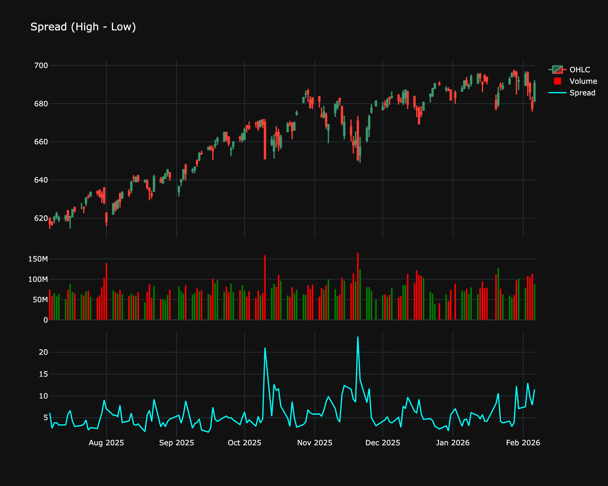

# Spread (High - Low)

| Name | Type | Prerequisite | Use Cases |
| :--- | :--- | :--- | :--- |
| Spread (SPD) | Relative Value | OHLC Data | Pairs trading and identifying inter-market arbitrage. |

## Definition

The Spread indicator typically measures the difference between the High and Low prices for a given period. It is a direct measure of intraday volatility or range.

## Mathematical Equation

$$
\text{Spread} = \text{High} - \text{Low}
$$

## Visualization

## Trading Significance

1.  **Volatility**: Expanding spread indicates increasing volatility and potentially higher risk or opportunity. Compressing spread indicates consolidation.

2.  **Breakout Setup**: A period of low spread (narrow range bars) often precedes a significant expansion or breakout.

