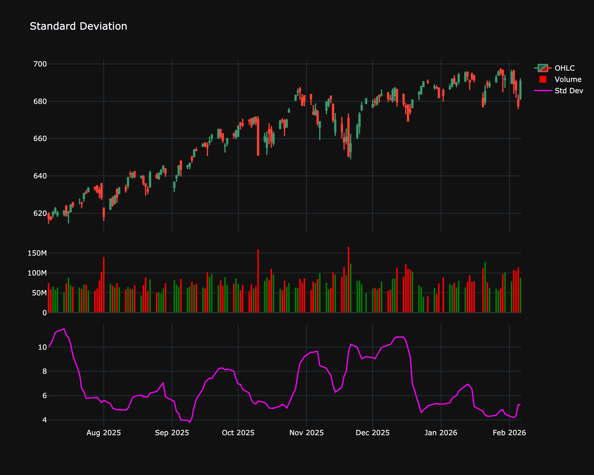

# Standard Deviation

| Name | Type | Prerequisite | Use Cases |
| :--- | :--- | :--- | :--- |
| Standard Deviation (StdDev) | Volatility | OHLC Data | Quantifies market risk and serves as the backbone for Bollinger Bands. |

## Definition

Standard Deviation is a statistical measure of volatility. In finance, it represents the dispersion of returns from the average return.

## Mathematical Equation

$$
\sigma = \sqrt{\frac{\sum(x - \bar{x})^2}{n}}
$$

## Visualization

## Trading Significance

1. **Volatility**: High Std Dev implies high volatility and potential risk.

2. **Market Tops/Bottoms**: Extremely high volatility often marks tops/bottoms.

