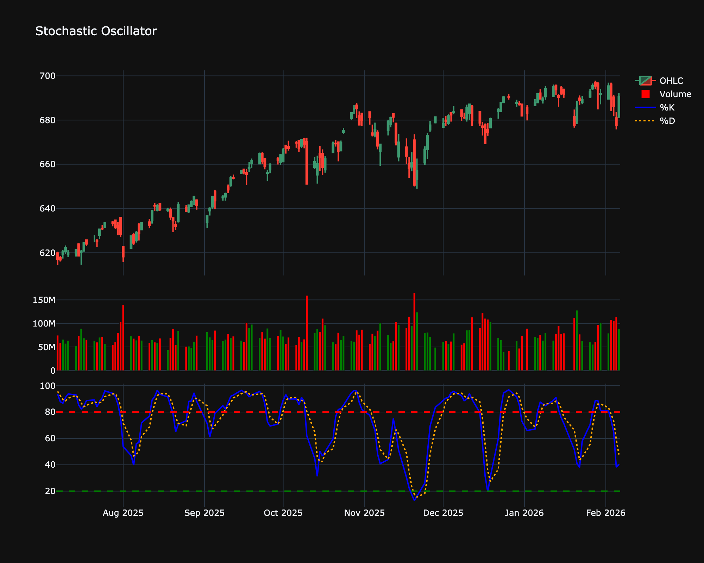

# Stochastic Oscillator

| Name | Type | Prerequisite | Use Cases |
| :--- | :--- | :--- | :--- |
| Stochastic Oscillator (STOCH) | Momentum | OHLC Data | Mean reversion and divergence trading. |

## Definition

The Stochastic Oscillator is a momentum indicator comparing a particular closing price of a security to a range of its prices over a certain period of time. The sensitivity of the oscillator to market movements is reducible by adjusting that time period or by taking a moving average of the result.

## Mathematical Equation

$$
\begin{align}
\%K &= 100 \times \frac{C - L_{14}}{H_{14} - L_{14}} \\
\%D &= \text{SMA}_3(\%K)
\end{align}
$$

 

Where:

*   $C$ = The most recent closing price

*   $L_{14}$ = The lowest price traded of the 14 previous trading sessions

*   $H_{14}$ = The highest price traded during the same 14-day period

*   $\%K$ = The current value of the stochastic indicator

## Visualization

## Trading Significance

1. **Overbought/Oversold**: Values > 80 indicate overbought; < 20 indicate oversold.

2. **Crossovers**: %K crossing above %D is a buy signal; below is a sell signal.

3. **Divergence**: Bullish/Bearish divergence signals potential reversals.

