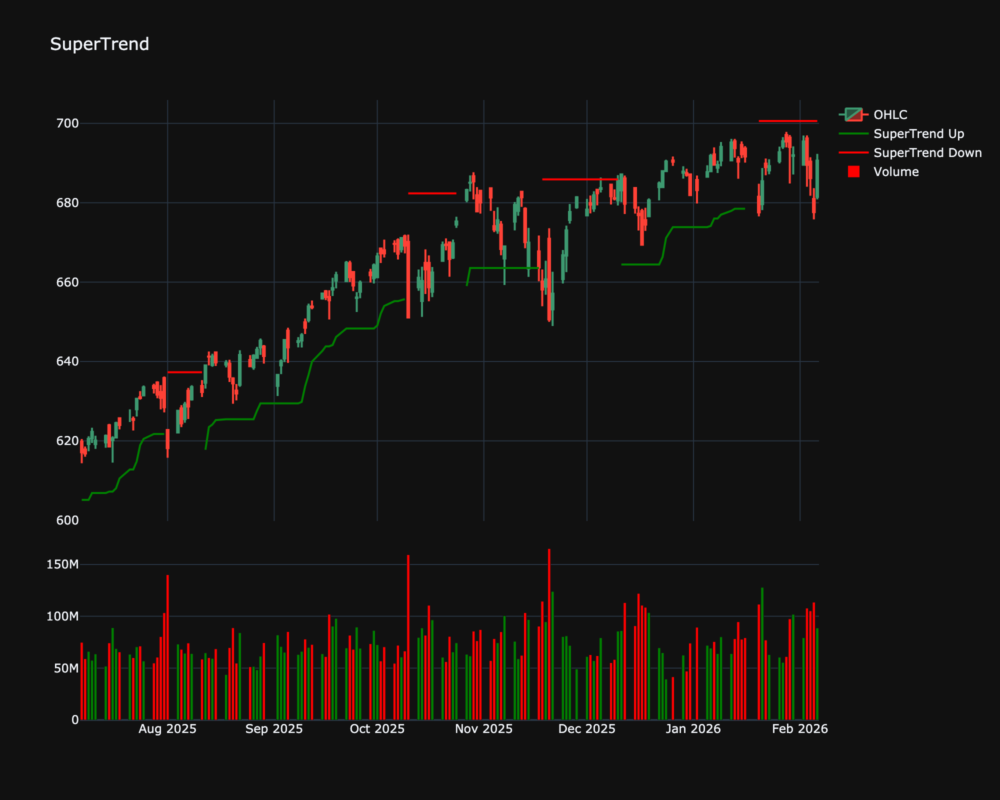

# SuperTrend

| Name | Type | Prerequisite | Use Cases |
| :--- | :--- | :--- | :--- |
| SuperTrend (ST) | Trend/Regime | ATR | Clear buy/sell signals and trailing stops. |

## Definition

SuperTrend is a trend-following indicator similar to moving averages. It is plotted on prices and their placement indicates the current trend. It relies on the Average True Range (ATR) to calculate its value.

## Mathematical Equation

$$
\text{Upper Band} = \frac{(\text{High} + \text{Low})}{2} + (\text{Multiplier} \times \text{ATR})
$$

 

$$
\text{Lower Band} = \frac{(\text{High} + \text{Low})}{2} - (\text{Multiplier} \times \text{ATR})
$$

 

The SuperTrend line switches between Upper and Lower/Close depending on trend direction.

## Visualization

## Trading Significance

1. **Stop Loss**: Excellent for trailing stop losses.

2. **Trend Direction**: Buying when the line flips to green (below price) and selling when it flips to red (above price).

