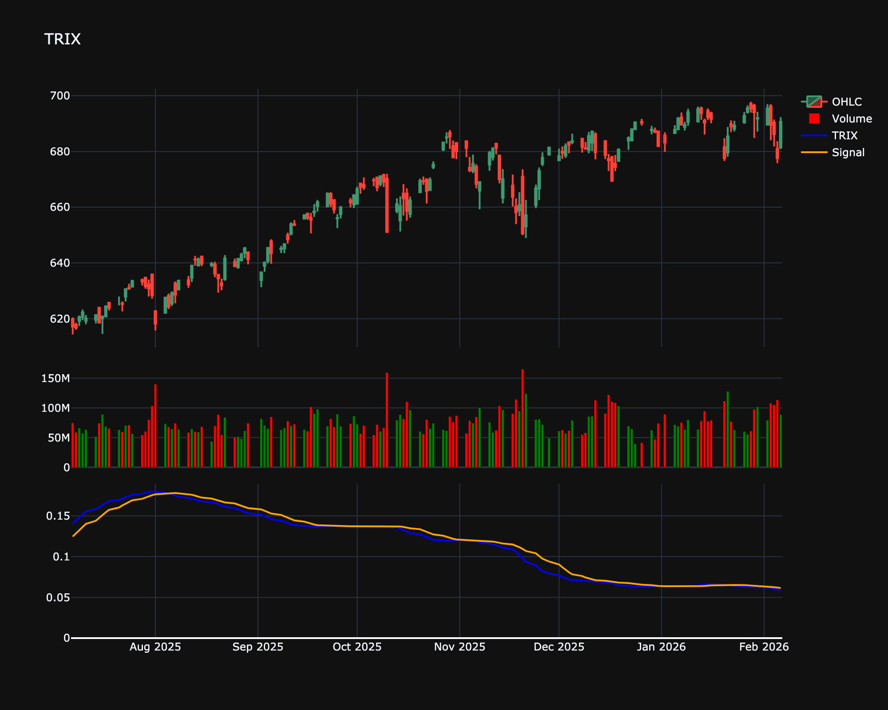

# TRIX

| Name | Type | Prerequisite | Use Cases |
| :--- | :--- | :--- | :--- |
| TRIX (TRX) | Trend/Momentum | EMA | Filtering out insignificant cycles and noise. |

## Definition

TRIX is a momentum oscillator that displays the percent rate of change of a triple exponentially smoothed moving average. It was developed by Jack Hutson in the early 1980s. By filtering out insignificant price movements, TRIX is designed to filter out noise and highlight the underlying trend.

## Mathematical Equation

1.  Calculate the $N$-period EMA of the closing price: $EMA1$

2.  Calculate the $N$-period EMA of $EMA1$: $EMA2$

3.  Calculate the $N$-period EMA of $EMA2$: $EMA3$

4.  Calculate the 1-period percent change of $EMA3$:

    

$$
TRIX = \frac{EMA3_t - EMA3_{t-1}}{EMA3_{t-1}} \times 100
$$

## Visualization

## Trading Significance

1.  **Zero Line Crossover**:

    *   **Buy**: TRIX crosses above the zero line (momentum turning positive).

    *   **Sell**: TRIX crosses below the zero line (momentum turning negative).

2.  **Signal Line Crossover**: A signal line (usually a moving average of TRIX) can be used for earlier entry/exit signals.

3.  **Divergence**: Divergence between TRIX and price can signal potential reversals.

