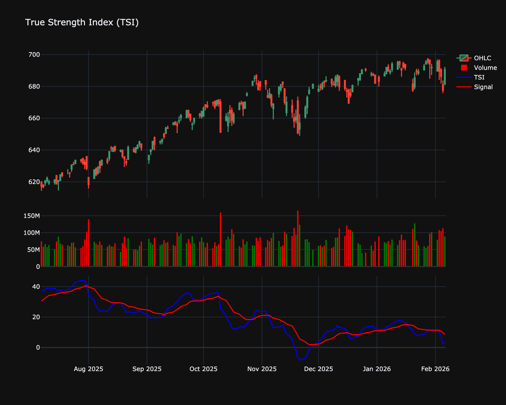

# True Strength Index (TSI)

| Name | Type | Prerequisite | Use Cases |
| :--- | :--- | :--- | :--- |
| True Strength Index (TSI) | Momentum | EMA | Identifying trend direction and overbought/oversold levels. |

## Definition

The True Strength Index (TSI) is a momentum oscillator based on a double smoothing of price changes.

## Mathematical Equation

$$\nTSI = 100 \times \frac{\text{EMA}(\text{EMA}(\text{Price Change}))}{\text{EMA}(\text{EMA}(|\text{Price Change}|))}\n$$

## Visualization

## Trading Significance

*   **Category**: Momentum

*   **Use Case**: Identifies overbought/oversold conditions and trend direction.

