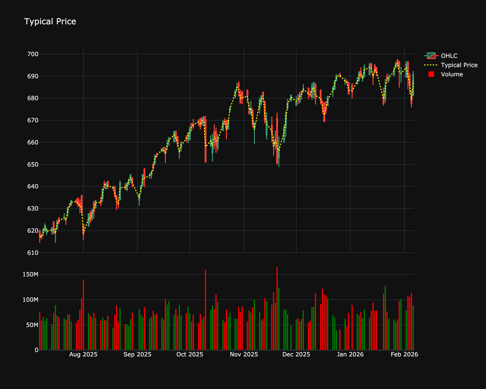

# Typical Price

| Name | Type | Prerequisite | Use Cases |
| :--- | :--- | :--- | :--- |
| Typical Price (TP) | Trend/Benchmark | OHLC Data | Serves as the base input for more complex indicators like CCI and VWAP. |

## Definition

Typical Price is an average of the High, Low, and Close prices for a given period. It provides a simple, single-value representation of the price action for each bar and is often used as an input for other indicators (like CCI and VWAP) instead of just the Close price.

## Mathematical Equation

$$
\text{Typical Price} = \frac{\text{High} + \text{Low} + \text{Close}}{3}
$$

## Visualization

## Trading Significance

1.  **Pivot Point**: It acts as a rudimentary pivot point for the day/bar.

2.  **Filter**: Trading above the typical price can be seen as bullish, while trading below it can be seen as bearish.

