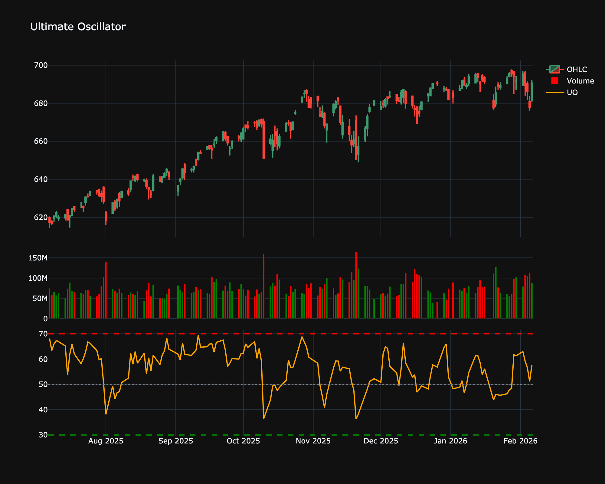

# Ultimate Oscillator

| Name | Type | Prerequisite | Use Cases |
| :--- | :--- | :--- | :--- |
| Ultimate Oscillator (UO) | Momentum | OHLC Data | Reducing false overbought/oversold signals. |

## Definition

The Ultimate Oscillator (UO) was developed by Larry Williams. It combines short-term, intermediate-term, and long-term timeframes into a single oscillator. By using weighted averages of three different timeframes, it aims to reduce false signals.

## Mathematical Equation

It calculates Buying Pressure (BP) and True Range (TR) for 7, 14, and 28 periods.

$$
UO = \frac{4 \times Avg_7 + 2 \times Avg_{14} + 1 \times Avg_{28}}{4+2+1} \times 100
$$

Where $Avg_N = \sum BP_N / \sum TR_N$.

## Visualization

## Trading Significance

1.  **Buy Signal**: Bullish divergence (price lower low, UO higher low) when UO is below 30, followed by a breakout above the divergence high.

2.  **Sell Signal**: Bearish divergence (price higher high, UO lower high) when UO is above 70, followed by a breakdown.

3.  **Overbought/Oversold**: Levels < 30 are oversold; > 70 are overbought.

