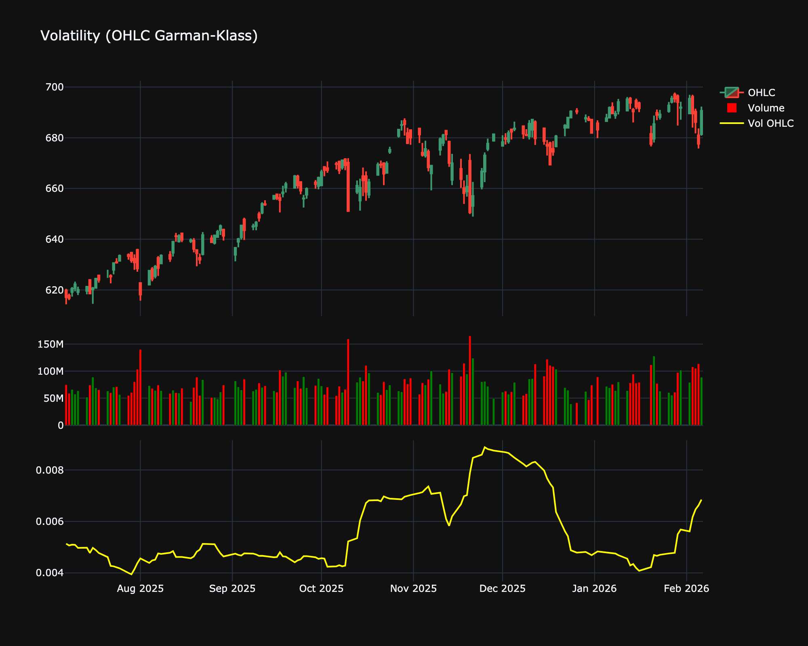

# Volatility (OHLC Garman-Klass)

| Name | Type | Prerequisite | Use Cases |
| :--- | :--- | :--- | :--- |
| Volatility O-H-L-C (OHLC Vol) | Volatility | OHLC Data | Provides a more granular risk assessment than close-only models. |

## Definition

The Garman-Klass volatility estimator is an extension of the Parkinson estimator that includes opening and closing prices, not just High and Low. It is more efficient than Close-to-Close volatility as it utilizes information from the entire bar.

## Mathematical Equation

$$
\sigma^2 = 0.5 \ln\left(\frac{High}{Low}\right)^2 - (2\ln 2 - 1) \ln\left(\frac{Close}{Open}\right)^2
$$

## Visualization

## Trading Significance

1.  **Efficiency**: Provides a more accurate estimate of volatility by incorporating intraday range and opening gaps.

2.  **Intraday Risk**: Better captures the true trading range risk experienced during the session.

