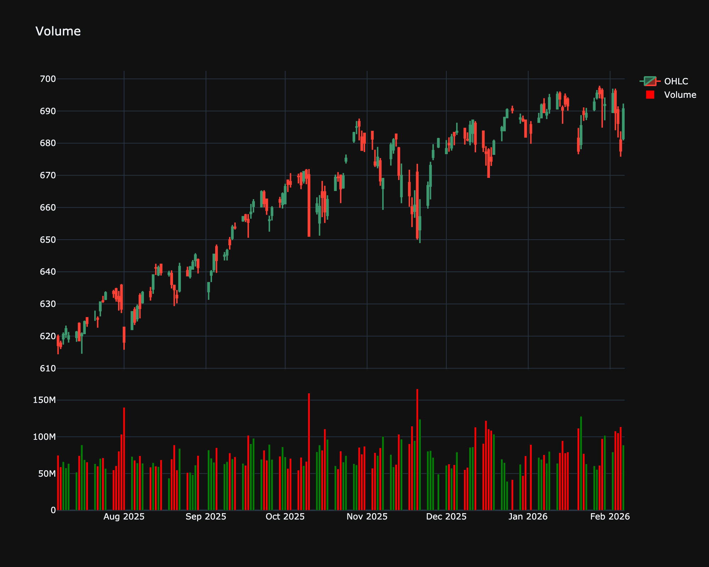

# Volume

| Name | Type | Prerequisite | Use Cases |
| :--- | :--- | :--- | :--- |
| Volume (V) | Volume | Price & Volume | Gauges market activity and validates the strength of price moves. |

## Definition

Volume represents the total number of shares or contracts traded for a specified security during a specified period of time. It is a fundamental measure of the intensity of trading activity.

## Visualization

## Trading Significance

1.  **Confirmation**: Volume confirms trends; a rising market should have rising volume.

2.  **Weakness**: A rising market with falling volume may indicate valid price action but a lack of conviction (divergence).

