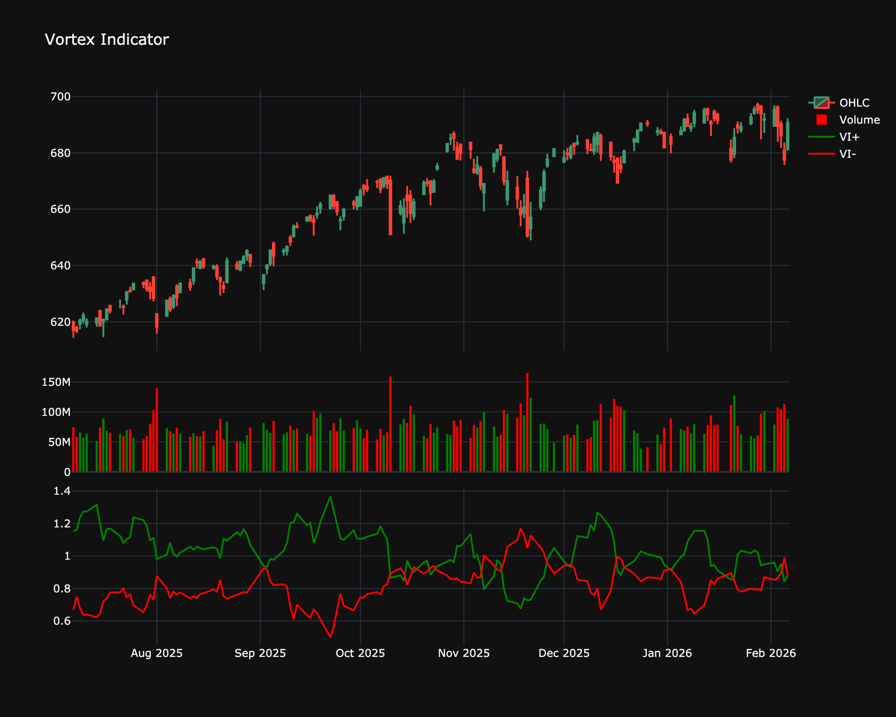

# Vortex Indicator

| Name | Type | Prerequisite | Use Cases |
| :--- | :--- | :--- | :--- |
| Vortex Indicator (VI) | Trend | OHLC Data | Spotting trend reversals and identifying current trend direction. |

## Definition

The Vortex Indicator (VI) consists of two lines: VI+ (positive trend movement) and VI- (negative trend movement). It identifies the start of a new trend and defines the current trend direction. It is inspired by the flow of water (vortices).

## Mathematical Equation

It compares the distance between the current high and previous low (positive movement) versus the current low and previous high (negative movement), summed and normalized over a period.

## Visualization

## Trading Significance

1.  **Crossovers**:

    *   **Buy**: VI+ crosses above VI-.

    *   **Sell**: VI- crosses above VI+.

2.  **Trend Strength**: The wider the gap between VI+ and VI-, the stronger the trend.

