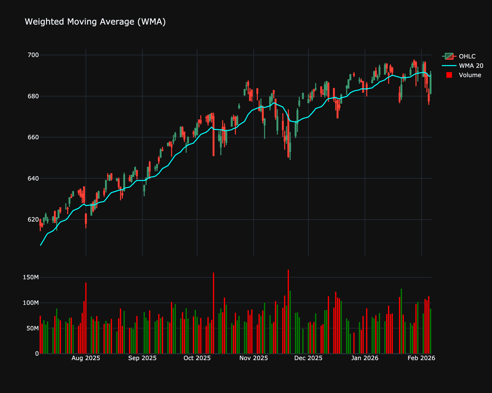

# Weighted Moving Average (WMA)

| Name | Type | Prerequisite | Use Cases |
| :--- | :--- | :--- | :--- |
| Weighted Moving Average (WMA) | Trend | OHLC Data | Provides a faster response than SMA while being less volatile than EMA. |

## Definition

The Weighted Moving Average (WMA) is similar to the SMA but assigns a linear weighting to the data points, giving more mathematical importance to recent data points. This makes it more responsive to price changes than the SMA.

## Mathematical Equation

$$
WMA_n = \frac{\sum_{i=1}^{n} P_i \times i}{\sum_{i=1}^{n} i}
$$

 

Where $P_i$ is the price at period $i$ (with $n$ being the most recent). denominator is the triangular number $\frac{n(n+1)}{2}$.

## Visualization

## Trading Significance

1. **Trend sensitivity**: WMA reacts faster to price changes than SMA, helping to catch trends earlier.

2. **Support/Resistance**: Can act as dynamic support/resistance lines.

