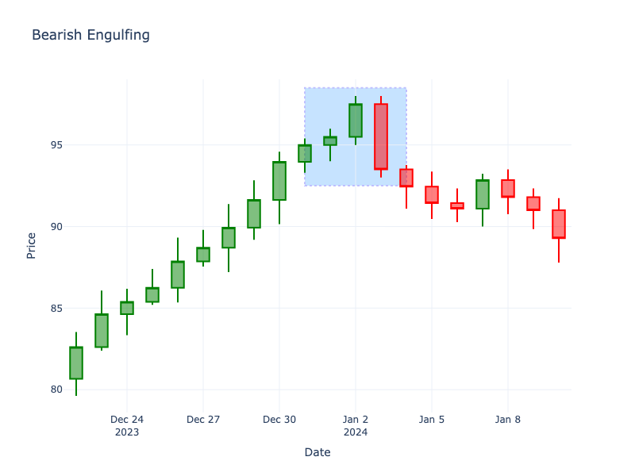

# Bearish Engulfing

| Name | Type | Prerequisite | Use Cases |
| :--- | :--- | :--- | :--- |
| Bearish Engulfing | Bearish Reversal | OHLC Data | Spotting trend reversals to the downside. |

## Definition

A Bearish Engulfing pattern occurs when a small green candlestick is followed by a large red candlestick that completely engulfs the real body of the previous green candle. This pattern typically appears at the top of an uptrend.

## Pattern Structure

-   **Candle 1**: Small green (bullish) body.
-   **Candle 2**: Large red (bearish) body that opens higher than Candle 1's close and closes lower than Candle 1's open.

## Mathematical Representation

$$
Open_2 > Close_1 \text{ and } Close_2 < Open_1
$$

## Visualization

## Story

The bulls are confidently marching the price higher, securing another green close. But suddenly, the market wakes up to a massive shift in sentiment. The bears open the next session higher but violently slam the price down, completely erasing the previous day's gains and then some. The resulting massive red candle visually devours the prior day's optimism, serving as a brutal wake-up call that the sellers have unequivocally taken the reins.

## Trading Significance

1.  **Overwhelming Selling Pressure**: The large red candle signifies that sellers have aggressively taken control.
2.  **Top Formation**: Often marks the end of an uptrend or a significant resistance level.
