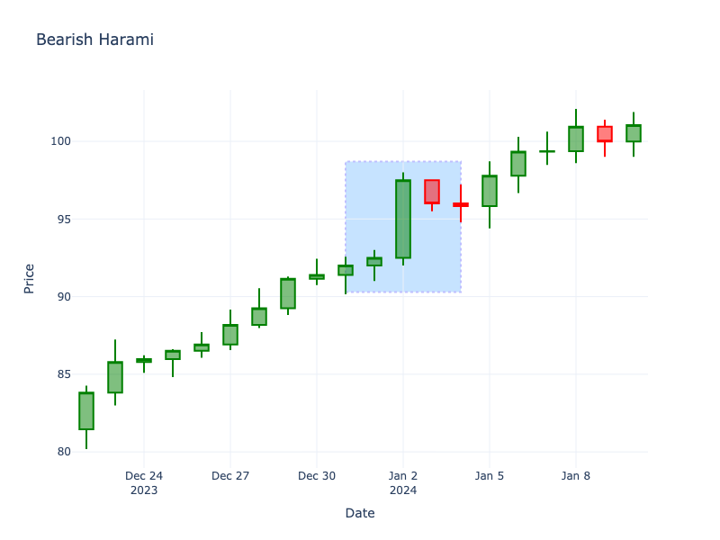

# Bearish Harami

| Name | Type | Prerequisite | Use Cases |
| :--- | :--- | :--- | :--- |
| Bearish Harami | Bearish Reversal | OHLC Data | Indicating a potential reversal or pause in an uptrend. |

## Definition

The Bearish Harami consists of a large green candle followed by a smaller red candle whose body is completely contained within the vertical range of the previous green candle's body.

## Pattern Structure

1.  **Candle 1**: Long green candle.
2.  **Candle 2**: Small red candle contained entirely within the body of Candle 1.

## Mathematical Representation

$$
Close_1 > Open_2 \text{ and } Open_1 < Close_2
$$

## Visualization

## Story

The bulls are firmly in control, enjoying a powerful surge upwards. But the immediate next session is strangely quiet—opening lower and trading in a narrow range entirely contained within the previous day's massive green body. The buying frenzy has abruptly stopped. This pregnant pause indicates that the bulls have exhausted their capital and the bears are beginning to build a defensive wall, foreshadowing an imminent reversal.

## Trading Significance

1.  **Buying Exhaustion**: The small red candle inside the previous green one suggests that buyers are losing conviction.
2.  **Trend Shift**: Often precedes a market top or a period of consolidation.
